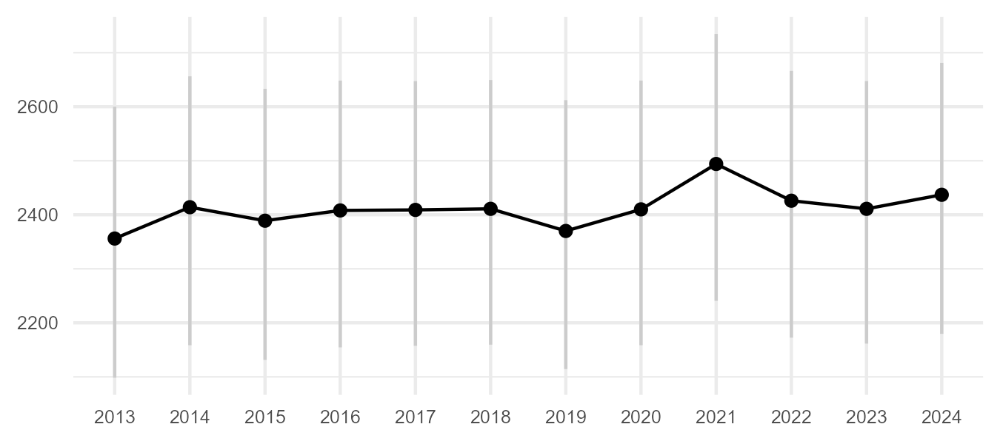
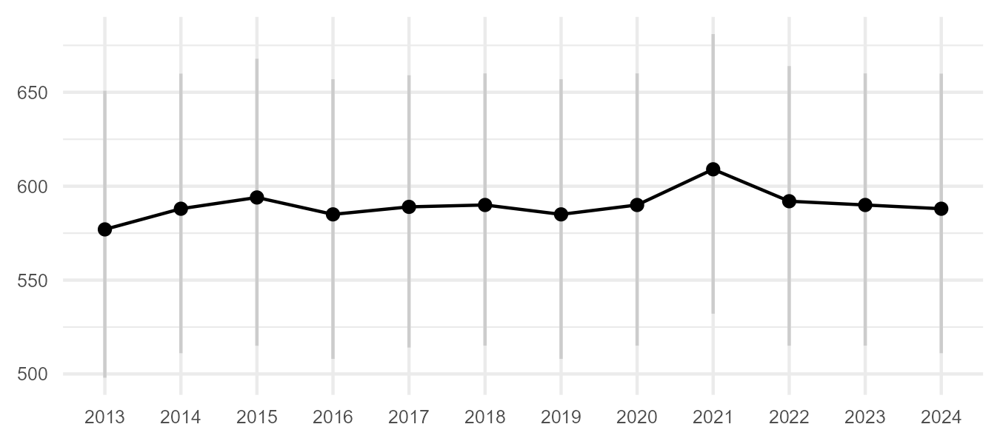
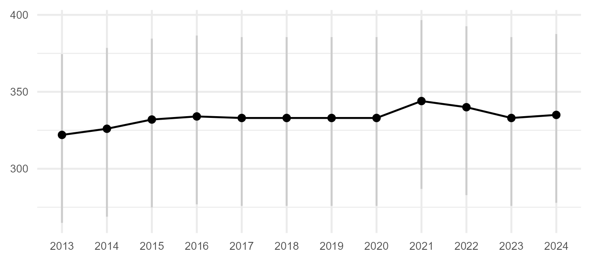
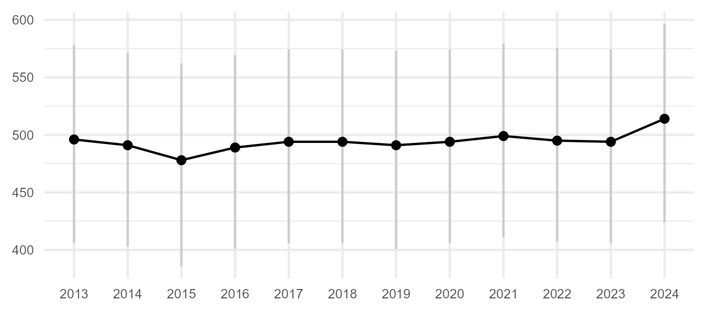
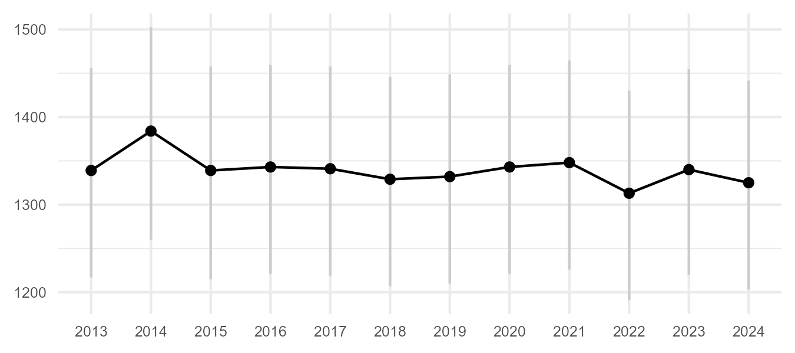
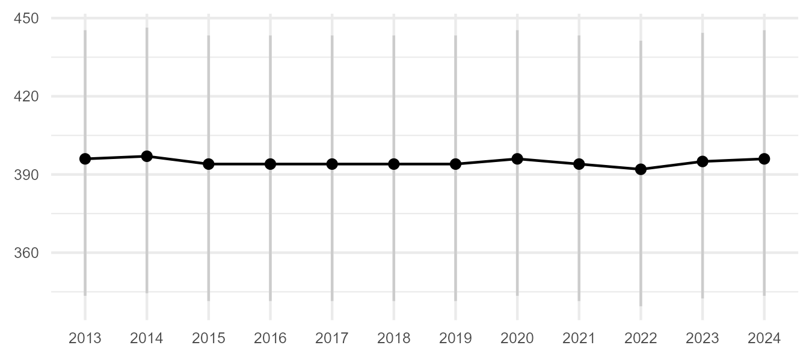

```{r setup, include=FALSE}
knitr::opts_chunk$set(
  echo = FALSE,
  fig.path = "fig/",
  dev = "png"
  )

# loading packages
library(sf)
#library(geos)
library(units)
library(tidyverse)
library(lubridate)
library(ggrepel)
library(readxl)
library(scales)
library(pals)
#library(terra)
#library(ggpubr)
library(RColorBrewer)
#library(tidyterra)
#library(xml2)
#library(XML)
library(kableExtra)
#library(flextable)
#library(ftExtra)

options(dplyr.summarise.inform=FALSE)
options(warn=-1)


eesti<-st_read("ref/taust.gpkg", "eesti", quiet=T)
ebi<-read_excel("ref/Eesti linnud 20250211.xlsx") %>%
  select(`3+3`,nimi_ek,ladnimi, selts_lk, selts_ek, sugukond_lk, sugukond_ek)%>%
  mutate(liik=tolower(`3+3`), ord=1:nrow(.))

arvymard<-function(x) {
  y <- case_when(
    x <= 200 ~ round(x,0),
    x >200 & x<=2000 ~ 10*round(x/10,0),
    x >2000 & x<=20000 ~ 100*round(x/100,0),
    x >20000 & x<=200000 ~ 1000*round(x/1000,0),
    x >200000 ~ 1e4*round(x/1e4,0),
    TRUE ~ x
  )
  return(y)
}

slsj <- st_read("src/PR0101_sj_n399_ar.shp")

agr <- read_csv2("src/PR0101_agregeeritud_seireandmed.csv")


p <- slsj %>%
  filter(!is.na(aastad) & !aastad=="") %>%
  #st_centroid() %>%
  ggplot() +
  geom_sf(color="brown2", fill="brown1", linewidth=0.1) +
  #geom_sf(aes(fill=viimane))+
  geom_sf(data=eesti, fill=NA, color="#CCCCCC") +
  #geom_text_repel(data = trid, aes(x = x, y = y, label = transekt), size=2.5, nudge_x = c(1, -1.5, 2, 2, -1), nudge_y = c(0.25,-0.25, 0.5, 0.5, -0.5)) +
  theme_bw() + xlab("") + ylab("")+
  theme(legend.title = element_blank(), legend.text=element_text(size=6), axis.text=element_text(size=6))
ggsave("fig/pr0101_sj.png", width=4.5, height=3, bg="white")

```

## Metoodika

Soolindude seire ehk ametliku nimetusega haudelindude koosluste seire (madalsood ja rabad) on elustiku mitmekesisuse seireprogrammi üks osa. Seiremetoodika kirjeldus on leitav Keskkonnaagentuuri seireankeetide lehelt: https://keskkonnaagentuur.ee/seireankeedid. Soode haudelindude seire on "inventuuri"-laadne seire, kus enamikku seirealasid kordusseiratakse ca 9-12 aasta tagant. Nigula rabas toimub haudelindude seire iga-aastaselt, alates aastast 1968.  

<!--figure>
  
  <figcaption><b>Joonis.</b> Programmi PR0101 ehk haudelindude kooslused (madalsood ja rabad) seirealad. Need ei sisalda veel 2023 ja 2024 kevadel esmakordselt uuritud soid, mis asuvad Hiiumaal.</figcaption>
</figure!-->


```{r fig.cap='<b>Joonis.</b> Programmi PR0101 ehk haudelindude kooslused (madalsood ja rabad) seirealad. Need ei sisalda veel 2023 ja 2024 kevadel esmakordselt uuritud soid, mis asuvad Hiiumaal.', fig.width=4}
knitr::include_graphics('fig/pr0101_sj.png')
```


Soode haudelinde seiratakse pesitsusterritooriume kaardistades, liikudes eelnevalt kindlaks määratud loendusrada ehk transekti mööda. Kogu soomassiiv kaetakse transektidega, mis paigutatakse regulaarse intervalliga, reeglina 400 m vahega (loendusriba laius 200+200 m). Puisemates sookooslustes kasutatakse kitsamat transektivahemikku (nt Avaste soos 300 m ehk 150+150 m) ning mõnedel täiesti lagedatel soodel laiemat transektivahemikku (nt Elbu rabal ja Kuresoo lääneosal 500 m ehk 250+250 m). Järgmisel seirekorral kasutatakse tulemuste võrreldavuse tagamiseks samu transekte.

Arvukuse hinnangud anti kolmel meetodil:

* Viimase seirekorra loendustulemuse põhjal
* Vaatleja märkamiskauguse vähenemist arvesse võttes (*distance sampling*)
* Arvukusmudeli (TRIM) põhjal
* Uurimata elupaigaga parandatud ehk elupaigamudeli ekstrapoleeringu põhjal

Arvukuse ja trendide hindamiseks kasutati `R` [@r] laiendust `rtrim` [@rtrim]. Andmed laeti keskkonnaseire infosüsteemist KESE (https://kese.envir.ee), kus II taseme näitajate vormil (https://kese.envir.ee/kese/AggregatedParameterValueLink) kasutati järgnevat päringut.

* Seireprogramm **Haudelindude kooslused (madalsood ja rabad)**
* Seireaasta **1986-2022**
* Näitaja kood **N2002237**


## Tulemused

### Viimasel loendusel põhinev arvukushinnang

Viimase loendustulemuse põhjal saadud arvukused on toodud järgnevas tabelis. Siin on käsitletud vaid liike, kelle summaarne pesitsuspaaride arv seirealadel viimastel andmetel oli vähemalt 10 pesitsuspaari.

<!--p><b>Tabel.</b> Arvukamate soolindude koondarvukused viimase loenduse põhjal.</p !-->
```{r arvviimane, echo=F}
viimane <- agr %>% group_by(`Seirekoha KKR`) %>%
  summarise(Seireaeg=max(Seireaeg)) %>%
  left_join(agr %>% select(`Seirekoha KKR`, Seireaeg, `Liik/takson (lad)`, `Mõõdetud arvväärtus`), by=c("Seirekoha KKR", "Seireaeg"))

viimane1<-viimane %>%
  group_by(`Liik/takson (lad)`) %>%
  summarise(loendus=sum(`Mõõdetud arvväärtus`)) %>%
  rename(liik=`Liik/takson (lad)`) %>%
  arrange(desc(loendus))

viimane1 %>%
  left_join(ebi %>% select(nimi_ek, ladnimi, ord) %>% rename(liik=ladnimi), by="liik") %>%
  filter(
    liik%in%c(
      "Pluvialis apricaria",
      "Lyrurus tetrix",
      "Vanellus vanellus",
      "Tringa glareola",
      "Gallinago gallinago",
      "Larus canus",
      "Tringa totanus",
      "Numenius phaeopus",
      "Bucephala clangula",
      "Anas platyrhynchos",
      "Limosa limosa",
      "Lanius collurio",
      "Tringa nebularia",
      "Turdus viscivorus",
      "Numenius arquata",
      "Anas crecca",
      "Calidris pugnax",
      "Lanius excubitor",
      "Chroicocephalus ridibundus",
      "Aythya fuligula",
      "Hydrocoloeus minutus",
      "Circus pygargus",
      "Larus argentatus",
      "Cygnus cygnus",
      "Circus aeruginosus",
      "Podiceps auritus",
      "Calidris alpina schinzii",
      "Charadrius dubius",
      "Spatula clypeata",
      "Chlidonias niger",
      "Lagopus lagopus",
      "Mareca penelope"
    )
  ) %>%
  arrange(-desc(ord)) %>%
  mutate(
    Liik=paste0(nimi_ek," <i>",liik,"</i>"),
    loendus=as.integer(loendus)
  ) %>%
  select(Liik,loendus) %>%
  rename(Loendus=loendus) %>%
  #kbl(booktabs = T, escape=F) %>%
  #kable_classic(full_width = FALSE) %>%
  #kable_styling(full_width = T, font_size =8, fixed_thead = T)
  #kable_styling(font_size =8, fixed_thead = T)
  #kable(escape=F)
  kbl(escape=F, caption="<b>Tabel.</b> Arvukamate soolindude summaarsed arvukused (paaride arv) viimase loenduse põhjal. Tedre ja tutka puhul on tabelis toodud mängudes loetud isaslindude (kukkede) arv.") %>%
  #kable_styling(font_size =10) %>%
  #kable_classic(full_width = FALSE)
  #kable_styling(bootstrap_options = "striped", full_width = F, font_size = 8, fixed_thead = T
  kable_styling(full_width = F, bootstrap_options = "striped")
```
</br>


### Vaatleja märkamiskauguse vähenemist arvestav hinnang (*distance sampling*)

Standardne loendusriba laius soolinnuloendustel on 200 m. Liikimisjoonest kaugenedes lindude avastamistõenäosus väheneb, ning seda sõltuvalt liigist. Häälekad ning territooriumi lähedusest häälekalt märku andvad kurvitsalised on paremini avastatavad kui värvulised. Lisaks liigile sõltub märkamiskaugus ka vaatlejast ning koosluse puistu tihedusest. Viimast tegurit käesolevas ei arvestata, kuna uuringu all olevad liigid esinevad enamasti lagedamatel soo-osadel.

Käesolevas on vaatlused nende avastamiskauguse põhjal 200 m loendusribas jagatud viide loendusribasse $b=1..5$. Ribad on jaotatud vastavalt kaugustele $(25,50,100,150,200)$. Sel juhul võib ribas $b$ avastatud isendite arvu $y_{s,b}$ käsitleda juhusliku suurusena, mis tuleneb multinoomjaotusest, kus raja $s$ loendusriba tinglikud avastamistäenäosused on $\hat{c}_{s,b}$ ning avastatavate isendite arv $n_s$ avaldub läbi binoomjaotuse, mille parameetriteks on summaarne avastamismäär $\pi_s$ (ehk edukate katsete sagedus) ning tegelik isendite arv $N_s$ (katsete arv). Efektiivne avastamiskaugus varieerub vaatleja lõikes ning on tähistatud parameetriga  $\sigma_o$. Kui $d$ kaudu tähistatkse reeglina kontakti ristkaugust, siis antud mudelis tähistab $d_b$ loendusriba keskpunkti kaugust rajajoonest. Avastamisfunktsiooni lähendiks on valitud Gauss'i funktsioon.

$$
\begin{eqnarray}
\mathsf{log}(p_{s,b}) &=& -\frac{d_b^2}{2\sigma_o^2} \\
\hat{c}_{s,b} &=& \frac{p_{s,b}\times w_{s,b}}{\pi_s} \\
\pi_s &=& \sum_{b=1}^5 p_{s,b}\times w_{s,b} \\
n_s &\sim& \mathsf{Bin}(\pi_s, N_s) \\
y_{s,b} &\sim& \mathsf{Multi}(\hat{c}_{s,b},n_s) \\
N &=& \sum_{s=1}^{554} N_s \\
D &=& \frac{N}{A}
\end{eqnarray}
$$


```{r eval=F}
load("src/sood-20250314.RData")

obsostbands11<-vaatlus %>%
    st_drop_geometry() %>%
    filter(skeem=="sood") %>%
    filter(!is.na(liik) & !liik=="") %>%
    filter(liik=="pluapr") %>%
    filter(!is.na(hinnang) & hinnang>0) %>%
    filter(!is.na(band) & band<6) %>%
    group_by(transekt,obsrvr,band) %>%
    summarise(paare=sum(hinnang))

obsostbands11 %>%
  filter(obsrvr=="MeLe") %>%
  group_by(band) %>%
  summarise(mnpaare=mean(paare), lo=quantile(paare,.025), hi=quantile(paare,.975)) %>%
  ggplot()+
  geom_bar(stat="identity", aes(y=mnpaare, x=band))+
  geom_linerange(aes(x=band, ymin=lo, ymax=hi))+
  theme_minimal()+
```

Kuna parameetriliselt on antud mudelit väga keerukas lahendada, siis tuletatud parameetreid $N$ ning $D$ hinnatud mitteparameetrilise MCMC simulatsiooni teel. Selleks on kautatud R paketi `rjags` funtksionaalsust [@rjags]. Mitteparameetriline MCMC simulatsioon on kirjeldatud koodis "R/03-sldist.R", mille tulemused (objekt `postssummary`) on salvestatud faili "result/slsp-dist-20250315.RData".

Kuna simulatsiooni sisend ei sisalda kõigi seirealade vaatlusandmeid, annab üldarvukuse $N$ järeljaotuse põhjal hinnatud arvukusvahemik alahinanngu. Sellele lisame veel valimist välja jäänud seirealade pindala asustustihedusega $D$ ekstrapoleerides saadud arvukusvahemiku.


```{r}
load("result/slsp-dist-20250315.RData")

postssummary %>%
  filter(param=="N") %>%
  select(liik, loendatud, Lower95, Upper95) %>%
  left_join(
    slsjspdsarv %>% select(liik, loendus, N1, N3),
    by="liik"
  ) %>%
  mutate(
    loend=loendatud+loendus,
    H1=arvymard(Lower95+N1),
    H3=arvymard(Upper95+N3)
  ) %>%
  left_join(ebi %>% select(liik, nimi_ek, ladnimi, ord), by="liik")  %>%
  arrange(-desc(ord)) %>%
  mutate(
    Loendus=loendatud,
    Hinnang=paste0(Lower95,"..",Upper95),
    Loendamata=paste0(N1,"..",N3),
    Koond=paste0(H1,"..",H3),
    Liik=paste0(nimi_ek," <i>",ladnimi,"</i>")
  ) %>%
  select(Liik, Loendus, Hinnang, Loendamata, Koond) %>%
  #kable(escape=F)
  kbl(escape=F, caption='<b>Tabel.</b> Loendaja märkamiskauguse vähenemist arvestavad hinnangud. "Hinnang" on arvutatud 2013-2023 loendatud seirealade vaatlusandmete põhjal (kokku 554 transekti, mis asuvad 278 seireala peal). Sama alade valimi loendustulemus on esitatud veerul "Loendus". Valimist välja jäänud seirealadele hinnati arvukus asustustiheduse põhjal ning on toodud veerul "Loendamata". Koondhinanng kogu seirealade kohta (ümardatud) on toodud veerul "Koond".') %>%
  kable_styling(full_width = F, bootstrap_options = "striped")
```


Asustustiheduste hinnangud on toodud allolevas tabelis.

```{r}
postssummary %>%
  filter(param=="D") %>%
  select(liik, loendatud, Median, Lower95, Upper95) %>%
  left_join(ebi %>% select(liik, nimi_ek, ladnimi, ord), by="liik")  %>%
  arrange(-desc(ord)) %>%
  mutate(
    Loendus=loendatud,
    d1=formatC(Lower95, format="f", dec=",", digits=3),
    d2=formatC(Median, format="f", dec=",", digits=3),
    d3=formatC(Upper95, format="f", dec=",", digits=3),
    `D [paari/km²]`=paste0(d2, " (",d1,"..",d3,")"),
    Liik=paste0(nimi_ek," <i>",ladnimi,"</i>")
  ) %>%
  select(Liik, Loendus, `D [paari/km²]`) %>%
  #kable(escape=F)
  kbl(escape=F, caption='<b>Tabel.</b> Transektide (N=554) põhjal hinnatud asustustihedused, mediaan ning sulgudes 95%-tõenäosusvahemik.') %>%
  kable_styling(full_width = F, bootstrap_options = "striped")
```

</br>


### Arvukusmudeli põhine hinnang

Arvukusmudel sobitati lühiajalise trendiperioodi puhul 12-aastasele andmeperioodile, kus viimane aasta oli vaatluste viimane aasta. Pika-ajalise trendiperioodi puhul päriti andmed alates aastast 1980. Kuna seire toimub valdavalt intervalliga, siis kasutati lõhiajalise perioodi puhul mudeli tüüpi 1 (lineaarne mudel), koos ülehajumise arvestusega (overdisp=TRUE) ja ilma jadakorrelatsiooni arvestuseta (serialcor=FALSE).

`trim(count~site+year, data=data, model=1, overdisp=T, serialcor=F)`

Arvukused hinnati arvukusmudeli prognoositud üldarvukusest (funktsioon `totals`).

`totals(m, which="imputed", level=0.95)`

Viimase 6 aasta perioodi üldhinnangute 95%-vahemike põhjal hinnati pesitsusasurkonna suurus. Miinimumina arvestati 6-aastase tsükli 95%-usaldusvahemike miinimum ning maksimumiks 6-aastase tsükli 95%-usaldusvahemike maksimum. Arvukusmudelite sobitusprotseduur on kirjeldatud koodis "R/01-rtrimstrata.R" ning selle tulemused on väljastatud faili "result/spstrata-20250310-1.RData". Viimane sisaldab kolme objekti:

**overalls**
: Arvukuse trendihinnangud lühiajalise (ST) ja pika-ajalise (LT) perioodi kohta.

**indices**
: Arvukuse indeksid aastati.

**totals**
: Üldarvukused aastati.

<!--p><b>Tabel.</b> Arvukamate soolindude koondarvukused viimases 6-aastases tsüklis arvukusmudeli põhjal (ainult viimase 12 aasta andmed).</p !-->
```{r arvftrimst, echo=F}
load("result/spstrata-20250312-1.RData")

totals %>%
  filter(Periood=="ST") %>%
  select(-Periood) %>%
  group_by(Liik) %>%
  slice_max(order_by=time, n=6) %>%
  group_by(Liik) %>%
  summarise(min=min(lo), max=max(hi), Periood=paste0(min(time),"-",max(time))) %>%
  rename(liik=Liik) %>%
  left_join(ebi %>% select(nimi_ek, ladnimi, ord) %>% rename(liik=ladnimi), by="liik")  %>%
  arrange(-desc(ord)) %>%
  mutate(
    smin=arvymard(min),
    smax=arvymard(max),
    Hinnang=paste0(smin,"..",smax),
    Liik=paste0(nimi_ek," <i>",liik,"</i>")
  ) %>%
  select(Liik, Periood, Hinnang) %>%
  #kable(escape=F)
  kbl(escape=F, caption="<b>Tabel.</b> Arvukamate soolindude koondarvukused viimases 6-aastases tsüklis arvukusmudeli põhjal (ainult viimase 12 aasta andmed).") %>%
  kable_styling(full_width = F, bootstrap_options = "striped")
```
</br>


<!--p><b>Tabel.</b> Arvukamate soolindude koondarvukused viimases 6-aastases tsüklis arvukusmudeli põhjal (andmed alates 1980).</p !-->
```{r arvftrimlt, echo=F}

totals %>%
  filter(Periood=="LT") %>%
  select(-Periood) %>%
  group_by(Liik) %>%
  slice_max(order_by=time, n=6) %>%
  group_by(Liik) %>%
  summarise(min=min(lo), max=max(hi), Periood=paste0(min(time),"-",max(time))) %>%
  rename(liik=Liik) %>%
  left_join(ebi %>% select(nimi_ek, ladnimi, ord) %>% rename(liik=ladnimi), by="liik")  %>%
  arrange(-desc(ord)) %>%
  mutate(
    smin=arvymard(min),
    smax=arvymard(max),
    Hinnang=paste0(smin,"..",smax),
    Liik=paste0(nimi_ek," <i>",liik,"</i>")
  ) %>%
  select(Liik, Periood, Hinnang) %>%
  #kable(escape=F)
  kbl(escape=F, caption="<b>Tabel.</b> Arvukamate soolindude koondarvukused viimases 6-aastases tsüklis arvukusmudeli põhjal (andmed alates 1980).") %>%
  kable_styling(full_width = F, bootstrap_options = "striped")
```
</br>


### Uurimata elupaigaga parandatud hinnang

Uurimata elupaiga korrektsiooni leidmine toimub järgnevates etappides:

* Elupaiga esinemiskaardi leidmine
* Elupaiga kogupindala ja elupaiga asurkonna suuruse vahelise seose hindamine
* Uurimata elupaigalaikude leidmine ning nende asurkonna suuruse prognoos

Elupaiga esinemiskaart arvutati liigi elupaiga prognooskaardist. Prognooskaarti kalibreeriti 2019-2022 vaatlustega. Esinemis- ja puudumisandmed genereeriti tausta, loendustransektide ja vaatluste põhjal. Kui pikslis oli liigi vaatlus, siis omistati pikslile kontrollväärtus 1 (esinemine). Puudumised (N $\sim$ esinemiste arv) genereeriti vaatluste ruumi põhjal, millele lisati transektidega lõikuvad pikslid ning millest eemaldati territooriumite lähedusse (r=300 m) jäävad pikslid. Kasutati unikaalseid piksleid. Saadud pikslitele omistati kontrollväärtus 0 (puudumine). Järgnevalt teostati kalibratsioonanalüüs [@presenceabsence], kus võrreldi mudelprognoosi (piksli elupaigaprognoos, vahemikus 0..1) ning pikslile omistatud kontrollväärtust (0 või 1). Kalibratsioonanalüüsil hinnati esinemislävendi väärtus tingimusel, mille puhul tundlikkuse (õietiennustatud esinemiste) ja spetsiifilisuse (õietiennustatud puudumiste) summa on maksimaalne. Teisisõnu tähendab see seda, et esinemiste ja puudumiste veamäärade keskmised on minimaalsed.


#### Rüüt *Pluvialis apricaria*

```{r}
#load("result/slsp-pluapr.RData")
#opt<-optimal.thresholds(slspvalid, opt.methods=3)
load("result/slspelupvarv-1-10-100ha-20250313.Rdata")
```

<!--figure>
  
  <figcaption><b>Joonis.</b> Elupaiga esinemise tõenäosust (0..1) kirjeldav prognooskaart.</figcaption>
</figure!-->
```{r slsj-pluapr-sdm, fig.cap='<b>Joonis.</b> Elupaiga esinemise tõenäosust (0..1) kirjeldav prognooskaart.', fig.width=4}
knitr::include_graphics('fig/slsj-pluapr-sdm.png')
```

Kalibratsioonanalüüsil hinnatud esinemislävendi abil (rüüda puhul 0,56) teisendatakse prognooskaart elupaiga esinemiskaardiks.

<!--figure>
  
  <figcaption><b>Joonis.</b> Elupaiga esinemine.</figcaption>
</figure!-->
```{r slsj-pluapr-elup, fig.cap='<b>Joonis.</b> Elupaiga esinemine.', fig.width=4}
knitr::include_graphics('fig/slsj-pluapr-elup.png')
```

Viimase põhjal arvutatakse seirealadele elupaiga pindala ning võrreldakse seda loendatud paaride arvuga.

<!--figure>
  
  <figcaption><b>Joonis.</b> Elupaiga pindala seirealal (elup_ha) ning seireala asurkonna suurus (paare).</figcaption>
</figure!-->
```{r slsj-pluapr-eluphapaare, fig.cap='<b>Joonis.</b> Elupaiga pindala seirealal (elup_ha) ning seireala asurkonna suurus (paare).', fig.width=4}
knitr::include_graphics('fig/slsj-pluapr-eluphapaare.png')
```

Seos seireala asurkonna suurusega (paaride arv) ja seirealal oleva elupaiga pindalaga on enam-vähem lineaarne.

...

Mudeli põhjal prognoositi elupaigalaikudele nende tõenäoline asurkonna suurus. Kuna elupaigamudel ei arvesta elupaiga suurusega, siis sisaldab sel viisil saadud elupaiga prognoos väga palju väikesepinnalisi elupaiku, mis suure tõenäosusega on sobimatud. Hetkel arvestame parandi hindamisel vaid elupaigalaikudega, mille kogupindala on vähemalt 100 ha.

<!--figure>
  
  <figcaption><b>Joonis.</b> Uurimata elupaikade paiknemine.</figcaption>
</figure!-->
```{r slsj-pluapr-uurimata, fig.cap='<b>Joonis.</b> Uurimata elupaikade paiknemine.', fig.width=4}
knitr::include_graphics('fig/slsj-pluapr-uurimata.png')
```
</br>

<!--p><b>Tabel.</b> Uurimata elupaigalaikude minimaalse pindala lävendile vastav paaride arv.</p!-->
```{r}
slspelupvarv %>%
  filter(liik=="pluapr") %>%
  mutate(across(3:5,~arvymard(.x))) %>%
  select(-liik) %>%
  rename(`Lävend [ha]`=eluphalavend, `2,5%`=N1, `50%`=N2, `97,5%`=N3) %>%
  #kable(escape=F)
  kbl(escape=F, caption='<b>Tabel.</b> Uurimata elupaigalaikude minimaalse pindala lävendile vastav paaride arv.') %>%
  kable_styling(full_width = F, bootstrap_options = "striped")
```


Sarnane arvutuskäik on läbitud arvukamate sookahlajate ning hallõgija kohta. Tulemused kolme lävendil on esitatud allolevas tabelis.

<!--p><b>Tabel.</b> Uurimata elupaigalaikude pindala lävendile vastav paaride arv.</p !-->
```{r}
slspelupvarv %>%
  filter(eluphalavend==100) %>%
  left_join(ebi %>% select(liik, nimi_ek, ladnimi, ord), by="liik")  %>%
  arrange(-desc(ord)) %>%
  mutate(across(3:5,~arvymard(.x))) %>%
  select(-liik) %>%
  rename(`Lävend [ha]`=eluphalavend, `2,5%`=N1, `50%`=N2, `97,5%`=N3) %>%
  mutate(
    Liik=paste0(nimi_ek," <i>",ladnimi,"</i>")
  ) %>%
  select(Liik, `Lävend [ha]`, `2,5%`, `50%`, `97,5%`) %>%
  #kable(escape=F)
  kbl(escape=F, caption="<b>Tabel.</b> Uurimata elupaigalaikude pindala lävendile vastav paaride arv.") %>%
  kable_styling(full_width = F, bootstrap_options = "striped")
```

<!--p><b>Tabel.</b> Uurimata elupaigalaikude pindala lävendile vastav paaride arv.</p !-->
```{r}
slspelupvarv %>%
  filter(eluphalavend==10) %>%
  left_join(ebi %>% select(liik, nimi_ek, ladnimi, ord), by="liik")  %>%
  arrange(-desc(ord)) %>%
  mutate(across(3:5,~arvymard(.x))) %>%
  select(-liik) %>%
  rename(`Lävend [ha]`=eluphalavend, `2,5%`=N1, `50%`=N2, `97,5%`=N3) %>%
  mutate(
    Liik=paste0(nimi_ek," <i>",ladnimi,"</i>")
  ) %>%
  select(Liik, `Lävend [ha]`, `2,5%`, `50%`, `97,5%`) %>%
  #kable(escape=F)
  kbl(escape=F, caption="<b>Tabel.</b> Uurimata elupaigalaikude pindala lävendile vastav paaride arv.") %>%
  kable_styling(full_width = F, bootstrap_options = "striped")
```


### Arvukuse trend

<!--p><b>Tabel.</b> Arvukamate soolindude lühiajalised (12 aastat) arvukuse trendid.</p !-->
```{r arvtrendst, echo=F}
#load("result/spstrata-20250310-1.RData")
overalls %>% 
  filter(Periood=="ST") %>%
  select(Liik,from,upto,mul,se_mul,meaning) %>%
  rename(liik=Liik) %>%
  left_join(ebi %>% select(nimi_ek, ladnimi, ord) %>% rename(liik=ladnimi), by="liik")  %>%
  arrange(-desc(ord)) %>%
  mutate(
    Periood=paste(from,upto,sep="-"),`Perioodi pikkus`=upto-from+1,
    `CV%`=formatC(100*se_mul/mul,digits=2,format="f",dec=","),
    Tõusukordaja=formatC(mul,digits=3,dec=",",format="f"),
    `Tõusukordaja (CV%)`=paste(Tõusukordaja," (",`CV%`,")",sep=""),
    Trendiklass=gsub("[(p<0.05)]","",meaning),
    Trendiklass=gsub("[(p<0.01)]","",Trendiklass),
    Trendiklass=recode(Trendiklass,
                  "Strong increase "="tugev kasv",
                  "Moderate increase "="mõõdukas kasv",
                  "Moderate decrease "="mõõdukas langus",
                  "Strong decrease "="tugev langus",
                  "Uncertain"="ebaselge",
                  "Stable"="stabiilne"
                ),
    muut1=round(12*100*((mul-1.96*se_mul-1)),0), muut2=round(12*100*((mul+1.96*se_mul-1)),0),
    Muutus=paste0(muut1, "..", muut2),
    Liik=paste0(nimi_ek," <i>",liik,"</i>")
  ) %>%
  select(Liik, Periood, `Tõusukordaja (CV%)`, Trendiklass, Muutus) %>%
  #kable(escape=F)
  kbl(escape=F, caption="<b>Tabel.</b> Arvukamate soolindude lühiajalised (12 aastat) arvukuse trendid.") %>%
  kable_styling(full_width = F, bootstrap_options = "striped")
```
</br>


<!--p><b>Tabel.</b> Arvukamate soolindude pika-ajalised (alates 1980) arvukuse trendid.</p!-->
```{r arvtrendlt, echo=F}
overalls %>% 
  filter(Periood=="LT") %>%
  select(Liik,from,upto,mul,se_mul,meaning) %>%
  rename(liik=Liik) %>%
  left_join(ebi %>% select(nimi_ek, ladnimi, ord) %>% rename(liik=ladnimi), by="liik")  %>%
  arrange(-desc(ord)) %>%
  mutate(
    Periood=paste(from,upto,sep="-"),`Perioodi pikkus`=upto-from+1,
    `CV%`=formatC(100*se_mul/mul,digits=2,format="f",dec=","),
    Tõusukordaja=formatC(mul,digits=3,dec=",",format="f"),
    `Tõusukordaja (CV%)`=paste(Tõusukordaja," (",`CV%`,")",sep=""),
    Trendiklass=gsub("[(p<0.05)]","",meaning),
    Trendiklass=gsub("[(p<0.01)]","",Trendiklass),
    Trendiklass=recode(Trendiklass,
                  "Strong increase "="tugev kasv",
                  "Moderate increase "="mõõdukas kasv",
                  "Moderate decrease "="mõõdukas langus",
                  "Strong decrease "="tugev langus",
                  "Uncertain"="ebaselge",
                  "Stable"="stabiilne"
                ),
    Liik=paste0(nimi_ek," <i>",liik,"</i>"),
    muut1=round(12*100*((mul-1.96*se_mul-1)),0), muut2=round(12*100*((mul+1.96*se_mul-1)),0),
    Muutus=paste0(muut1, "..", muut2)
  ) %>%
  select(Liik, Periood, `Tõusukordaja (CV%)`, Trendiklass, Muutus) %>%
  #kable(escape=F)
  kbl(escape=F, caption="<b>Tabel.</b> Arvukamate soolindude pika-ajalised (alates 1980) arvukuse trendid.") %>%
  kable_styling(full_width = F, bootstrap_options = "striped")
```


## Kokkuvõte

#### Rüüt *Pluvialis apricaria*
Rüüda eelmine arvukushinnang [@elts19] oli 3000-4000 paari. Hinnang tuletati seirealade viimase loendustulemuse põhjal (2294 paari), korrigeerides seda aastatevahelise varieeruvuse (20%) ning ühekordse loenduse avastatavusega, milleks on keskmiselt 71% [@kolomodin]. Tulemusele lisati veel uurimata elupaiga tõenäoline asurkonna suurus, milleks hinnati 170-270 paari.  

Käesolevas hinnangus keskendume arvukusmudeli antud väljundile. Kuna seirealade arvukus on antud ühekordse loenduse põhjal ning sisaldab ka vaatleja märkamiskaugusest tulenevat alahinnangut, siis seirealade arvukused ning arvukusmudeli hinnangud on tõenäoliselt alahinnangud. Lühiajalise perioodi arvukusmudel annab viimase 6-aasta arvukuseks 2100-2700 paari. Suure tõenäosusega on eelmisel korral antud uurimata elupaiga asurkonna hinnang liiga optimistlik, kuna viimase 6 aasta sees esmakordselt uuritud sood pole andnud ootuspärast lisa. Lisades arvukusmudeli hinnangule uurimata elupaiga asurkonna suuruse (0-20 paari) ning korrigeerides tulemust 30%-ga, saame arvukushinnanguks **`r paste(arvymard(c(2100,2720)*1.3), collapse="-")`** paari. Loendaja märkamiskauguse vähenemise suhtes tasandatud hinnanguks seirealade pinnal saadi 2700-2800 paari. Arvestades viimasele juurde ühekordsest loendusest tulenev avastamata paaride arv, oleks hinnanguks `r paste(arvymard(c(2700,2800)*1.3), collapse="-")`, mille ülempiir ühtib enamvähem arvukusmudelist saaduga. Lühiajaline arvukuse trend (2013-2024) hinnati **stabiilseks** ning arvukuse muutust lühiajalises perioodis hinnati vahemikku **0..5%**. Kuna arvukushinnang erineb eelnevast hinnangust, siis märgime ära, et muutuse põhjus on metoodiline (*method*).

```{r eval=F}
load("result/spstrata-20250312-1.RData")
pd<-totals %>% 
  filter(Liik=="Pluvialis apricaria" & Periood=="ST")
p<-pd %>%
  ggplot()+
  geom_linerange(aes(x=time,ymin=lo,ymax=hi), color="#cccccc")+
  geom_line(aes(x=time,y=imputed))+
  geom_point(aes(x=time,y=imputed))+
  theme_minimal()+theme(axis.title=element_blank(), axis.text=element_text(size=6), panel.grid.minor.x=element_blank())+
  scale_x_continuous(breaks=2013:2024, labels=2013:2024)
  #ylim(0,pretty(range(pd$hi)[2])[2])
  ggsave(paste0("fig/slsj-pluapr-st-totals.png"), p, width=4.5, height=2, bg="white")
```

```{r slsj-pluapr-st, fig.cap='<b>Joonis.</b> Arvukusmudeli (lühiajaline periood) prognoositud üldarvukus seirealadel.', fig.width=3}

```

#### Väikekoovitaja *Numenius phaeopus*
Väikekoovitaja eelmine arvukushinnang [@elts19] oli 500-800 paari. Hinnang tuletati seirealade viimase loendustulemuse põhjal (660 paari), korrigeerides seda aastatevahelise varieeruvuse (15%) ning ühekordse loenduse avastatavusega, milleks on keskmiselt 90% [@kolomodin]. Tulemusele lisati veel uurimata elupaiga tõenäoline asurkonna suurus, milleks hinnati 40-60 paari.  

Väikekoovitajad on loenduste ajal väga liikuvad, mistõttu võib pelgalt vaatluste põhjal asustustiheduste arvutamine anda ülehinnanguid. Vaatleja märkamiskauguse vähenemise suhtes tasandatud hinnanguks saadi 570-640 paari. Uue analüüsi kohaselt ei lisandu ka uurimata elupaikadest arvestamata pesitsuspaare, mis on ka loogiline tulemus, kuna on vähetõenäoline, et liik väikeseid, uurimata soid asustaks. Arvukusmudeli hinnangue ühekordsest loendusest tuleneva alahinanngu lisamisel saame hinnanguks `r paste(arvymard(c(510,680)*1.1), collapse="-")` paari. Lühiajaline arvukuse trend (2013-2024) hinnati **stabiilseks** ning arvukuse muutust lühiajalises perioodis hinnati vahemikku **-2..5%**. Kuna trend on stabiilne, siis lähtume märkamiskauguse vähenemise suhtes tasandatud hinnangust, lisades sellele ühekordse loenduse avastatavuse, saades tulemuseks **`r paste(arvymard(c(570,640)*1.1), collapse="-")`** Kuna arvukushinnang erineb eelnevast hinnangust, siis märgime ära, et muutuse põhjus on metoodiline (*method*).

```{r eval=F}
pd<-totals %>% 
  filter(Liik=="Numenius phaeopus" & Periood=="ST")
p<-pd %>%
  ggplot()+
  geom_linerange(aes(x=time,ymin=lo,ymax=hi), color="#cccccc")+
  geom_line(aes(x=time,y=imputed))+
  geom_point(aes(x=time,y=imputed))+
  theme_minimal()+theme(axis.title=element_blank(), axis.text=element_text(size=6), panel.grid.minor.x=element_blank())+
  scale_x_continuous(breaks=2013:2024, labels=2013:2024)
  #ylim(0,pretty(range(pd$hi)[2])[2])
  ggsave(paste0("fig/slsj-numpha-st-totals.png"), p, width=4.5, height=2, bg="white")
```

```{r slsj-numpha-st, fig.cap='<b>Joonis.</b> Arvukusmudeli (lühiajaline periood) prognoositud üldarvukus seirealadel.', fig.width=3}

```

#### Suurkoovitaja *Numenius arquata*
Suurkoovitaja eelmine arvukushinnang [@elts19] oli 800-1200 paari, misi sisaldab ka kultuurmaade ja niitude asurkonna hinnangut. Soodes pesitseva asurkonna hinnang oli eelmisel korral 300-350. Hinnang tuletati seirealade viimase loendustulemuse põhjal (310 paari), korrigeerides seda ühekordse loenduse avastatavusega, milleks on keskmiselt 85% [@kolomodin]. Uurimata elupaiga tõenäolist asurkonna suurust, milleks hinnati 110-200 paari, ei lisatud, kuna vastav seos oli kesine ning tõenäoliselt ei ole ka suurkoovitaja elupaigad soode mõttes küllastunud.

Suurkoovitajad loenduste ajal väga liikuvad ning häälekad. Seetõttu tuleb kõiki vaatlusi koos liikumissuundade ja käitumisega seireala loendustulemuse hindamisel hoolikalt arvestada. Vaatleja märkamiskauguse vähenemise suhtes tasandatud hinnanguks saadi 320-350 paari. Lühajalise perioodi arvukusmudel annab meile viimase 6 aasta arvukuse vahemikuks 280-400 paari. Uurimata elupaikadest lisandub 0-35 pesitsuspaari. Võttes need andmed kokku, anname suurkoovitaja soode asurkonna suuruseks **`r paste(arvymard(c(280+0,400+35)*1), collapse="-")` paari**. Lühiajaline arvukuse trend (2013-2024) hinnati **tõusvaks** ning arvukuse muutust lühiajalises perioodis hinnati vahemikku **1..7%**. Kuna arvukushinnang erineb eelnevast hinnangust, siis märgime ära, et muutuse põhjus on metoodiline (*method*).

Antud hinnang kehtib soodes pesitseva asurkonna kohta, mistõttu Eesti hinangu saamiseks tuleb siia lisada kultuurmaadel pesitseva asurkonna hinnang. Transektloenduste andmete analüüsil (atlas+soome+sood) saadi suurkoovitaja hinnanguks 1080-1390 paari. Tulemus vajab veel verifitseerimist teiste meetoditega.

```{r eval=F}
pd<-totals %>% 
  filter(Liik=="Numenius arquata" & Periood=="ST")
p<-pd %>%
  ggplot()+
  geom_linerange(aes(x=time,ymin=lo,ymax=hi), color="#cccccc")+
  geom_line(aes(x=time,y=imputed))+
  geom_point(aes(x=time,y=imputed))+
  theme_minimal()+theme(axis.title=element_blank(), axis.text=element_text(size=6), panel.grid.minor.x=element_blank())+
  scale_x_continuous(breaks=2013:2024, labels=2013:2024)
  #ylim(0,pretty(range(pd$hi)[2])[2])
  ggsave(paste0("fig/slsj-numarq-st-totals.png"), p, width=4.5, height=2, bg="white")
```

```{r slsj-numarq-st, fig.cap='<b>Joonis.</b> Arvukusmudeli (lühiajaline periood) prognoositud üldarvukus seirealadel.', fig.width=3}

```

#### Mustsaba-vigle *Limosa limosa*
Mustsaba-vigle eelmine arvukushinnang [@elts19] oli 500-700 paari, misi sisaldab ka kultuurmaade ja niitude asurkonna hinnangut. Soodes pesitseva asurkonna hinnang oli eelmisel korral 500-600. Hinnang tuletati seirealade viimase loendustulemuse põhjal (500 paari), korrigeerides seda aastatevahelise varieeruvusega (25%). Ühekordse loenduse avastatavus eeldati selle liigi puhul olevat 100%. Arvestati ka uurimata elupaiga tõenäolist asurkonna suurus, milleks hinnati keskmiselt 50 paari (30-70).

Mustsaba-vigle tuumikasurkond jaguneb 5 rannikulähedase raba peale: Linnuraba, Marimetsa raba, Lihula raba, Võlla raba ning Laisma raba. Mujal esineb liiki vähemarvukamalt. Viimastel aastatel on vigled asunud ka sisemaa soodele (nt Keava raba, 2022), mis viitab sisemaa jätkuvale koloniseerimisele. Ka mustsaba-vigle on loendustel väga liikuv ning häälekas, mistõttu vaatlusandmete põhine hinnang ilma territooriumiteks tõlgenduseta annab tõenäoliselt seireala kohta ülehinanngu. Vaatleja märkamiskauguse vähenemise suhtes tasandatud hinnanguks saadi 480-520 paari. Lühajalise perioodi arvukusmudel annab meile viimase 6 aasta arvukuse vahemikuks 400-600 paari. Pika-ajaline arvukusmudel annab viimase 6 aasta arvukuseks 410-1540 paari. Tunduvalt suurem ülempiir tuleneb ilmselt sellest, et lühiajalise perioodi puhul on kasutusel lineaarne mudel ning pika-ajalise perioodi puhul käänupunktidega mudel. Viimase puhul võib esineda ebaharilikke väljalööke juhul kui seireaastal on valimis seireala, kus on väga suur arvukus võrreldes iga-aastaselt seires olnud seirealadega. Seetõttu tuleks kasutada lühiajalise mudeli hinanngut. Uurimata elupaikadest lisandub 0-115 pesitsuspaari. Arvukusmudelit ning uurimata elupaika arvestades, saame hinannguks `r paste(arvymard(c(400+0,600+115)), collapse="-")` paari. Lühiajaline arvukuse trend (2013-2024) hinnati **stabiilseks** ning arvukuse muutust lühiajalises perioodis hinnati vahemikku **-1..8%**. Kuna trend on stabiilne, siis lähtume märkamiskauguse suhtes tasandatud hinnangust, milleks on **480-520 paari**. Kuna arvukushinnang erineb eelnevast hinnangust, siis märgime ära, et muutuse põhjus on metoodiline (*method*).

Eesti asurkonna hinnagu saamiseks tuleb siia lisada veel rannaniitudel ja luhtadel pesitseva asurkonna suurus.

```{r eval=F}
pd<-totals %>% 
  filter(Liik=="Limosa limosa" & Periood=="ST")
p<-pd %>%
  ggplot()+
  geom_linerange(aes(x=time,ymin=lo,ymax=hi), color="#cccccc")+
  geom_line(aes(x=time,y=imputed))+
  geom_point(aes(x=time,y=imputed))+
  theme_minimal()+theme(axis.title=element_blank(), axis.text=element_text(size=6), panel.grid.minor.x=element_blank())+
  scale_x_continuous(breaks=2013:2024, labels=2013:2024)
  #ylim(0,pretty(range(pd$hi)[2])[2])
  ggsave(paste0("fig/slsj-limlim-st-totals.png"), p, width=4.5, height=2, bg="white")
```

```{r slsj-limlim-st, fig.cap='<b>Joonis.</b> Arvukusmudeli (lühiajaline periood) prognoositud üldarvukus seirealadel.', fig.width=3}

```

#### Mudatilder *Tringa glareola*
Mudatildri eelmine arvukushinnang [@elts19] oli 2000-3000 paari. Hinnang tuletati pindala-arvukus mudelist saadud arvukusvahemikust (1380–2010), korrigeerides seda ühekordse loenduse avastatavusega, milleks võti 75% [@kolomodin].

Mudatildri puhul võib eeldada, et märkamiskauguse vähenemise tõttu avastamata jääv paaride arv võib olla arvestatav. Kui viimane loendustulemus on 1399, siis vaatleja märkamiskauguse vähenemise suhtes tasandatud hinnanguks saadi 1440-1560 paari. Sellest võib järeldada, et liigi avastamismäär on hoolimata kahtlustest siiski väga kõrge. Lühiajalise perioodi arvukusmudel annab viimase 6 aasta arvukuseks 1190-1460 paari. Mudatildri puhul kasutame sobiva elupaiga lävendina 10 ha, mis annab uurimata elupaiga asurkonna prognoosiks 0-710 paari. See on põhjendatud, kuna mudatilder võib asustada ka näiteks jääksoid, mis jäävad seirealade arvestusest välja. Arvestades ka ühekordse loenduse tõttu avastamata jäänud paaride arvu, saame mudatildri pesitsusasurkonna suuruse hinnanguks **`r paste(arvymard(c(1190+0,1460+710)*1.25), collapse="-")` paari**. Lühiajaline arvukuse trend (2013-2024) hinnati **langevaks** ning arvukuse muutust lühiajalises perioodis hinnati vahemikku **-4..0%**. Kuna arvukushinnang erineb eelnevast hinnangust, siis märgime ära, et muutuse põhjus on ennekõike tegelik (*genuine*) kui ka metoodiline (*method*).

```{r eval=F}
pd<-totals %>% 
  filter(Liik=="Tringa glareola" & Periood=="ST")
p<-pd %>%
  ggplot()+
  geom_linerange(aes(x=time,ymin=lo,ymax=hi), color="#cccccc")+
  geom_line(aes(x=time,y=imputed))+
  geom_point(aes(x=time,y=imputed))+
  theme_minimal()+theme(axis.title=element_blank(), axis.text=element_text(size=6), panel.grid.minor.x=element_blank())+
  scale_x_continuous(breaks=2013:2024, labels=2013:2024)
  #ylim(0,pretty(range(pd$hi)[2])[2])
  ggsave(paste0("fig/slsj-trigla-st-totals.png"), p, width=4.5, height=2, bg="white")
```

```{r slsj-trigla-st, fig.cap='<b>Joonis.</b> Arvukusmudeli (lühiajaline periood) prognoositud üldarvukus seirealadel.', fig.width=3}

```

#### Heletilder *Tringa nebularia*
Mudatildri eelmine arvukushinnang [@elts19] oli 300-400 paari. Hinnang tuletati seirealade viimase loendustulemuse põhjal (310 paari), korrigeerides seda uurimata elupaiga asurkonnaga (keskmiselt 100 paari). Ühekordse loenduse avastatavust, milleks on keskmiselt 68% [@kolomodin], ei arvestatud.  

Lühiajalise perioodi arvukusmudel annab viimase 6 aasta arvukuseks 340-450 paari. Uurimata elupaiga asurkonna prognoosiks saadi 0-152 paari, mis on tõenäoliselt ülehinnang, kuna ei arvesta liigi põhja- ja kirdepoolse levimusega. Jättes uurimata elupaiga arvestamata, saame heletildri pesitsusasurkonna suuruse hinnanguks 340-450 paari. Vaatleja märkamiskauguse vähenemise suhtes tasandatud hinnanguks saadi 390-450 paari. Lühiajaline arvukuse trend (2013-2024) hinnati **stabiilseks** ning arvukuse muutust lühiajalises perioodis hinnati vahemikku **-1..0%**. Kuna trend on stabiilne, kasutame vaatleja märkamiskauguse vähenemise suhtes tasandatud hinnangut, Korrigeerides viimast ühekordsel loendusel avastamata jäänud paaridega, milleks saame **`r paste(arvymard(c(390,450)*1.32), collapse="-")` paari**.

Hinnangule tuleks juurde arvestada veel teistest elupaikadest (raiesmikud, jm) lisanduvad paarid.

```{r eval=F}
pd<-totals %>% 
  filter(Liik=="Tringa nebularia" & Periood=="ST")
p<-pd %>%
  ggplot()+
  geom_linerange(aes(x=time,ymin=lo,ymax=hi), color="#cccccc")+
  geom_line(aes(x=time,y=imputed))+
  geom_point(aes(x=time,y=imputed))+
  theme_minimal()+theme(axis.title=element_blank(), axis.text=element_text(size=6), panel.grid.minor.x=element_blank())+
  scale_x_continuous(breaks=2013:2024, labels=2013:2024)
  #ylim(0,pretty(range(pd$hi)[2])[2])
  ggsave(paste0("fig/slsj-trineb-st-totals.png"), p, width=4.5, height=2, bg="white")
```

```{r slsj-trineb-st, fig.cap='<b>Joonis.</b> Arvukusmudeli (lühiajaline periood) prognoositud üldarvukus seirealadel.', fig.width=3}

```

#### Punajalg-tilder *Tringa totanus*
Punajalg-tildri eelmine arvukushinnang [@elts19] oli 2500-3500 paari, mis sisldab nii soode kui ka teiste biotoopide hinnangut.  

Lühiajalise perioodi arvukusmudel annab viimase 6 aasta arvukuseks 540-730 paari. Vaatleja märkamiskauguse vähenemise suhtes tasandatud hinnanguks saadi 680-790 paari. Lühiajaline arvukuse trend (2013-2024) hinnati **stabiilseks** ning arvukuse muutust lühiajalises perioodis hinnati vahemikku **-2..5%**.


#### Hallõgija *Lanius excubitor*
Punajalg-tildri eelmine arvukushinnang [@elts19] oli 2500-3500 paari.

Viimastel loendusandmetel on hallõgijaid seirealadel 230 paari. Vaatleja märkamiskauguse vähenemise suhtes tasandatud hinnanguks saadi 220-280 paari.


## Kasutatud allikad