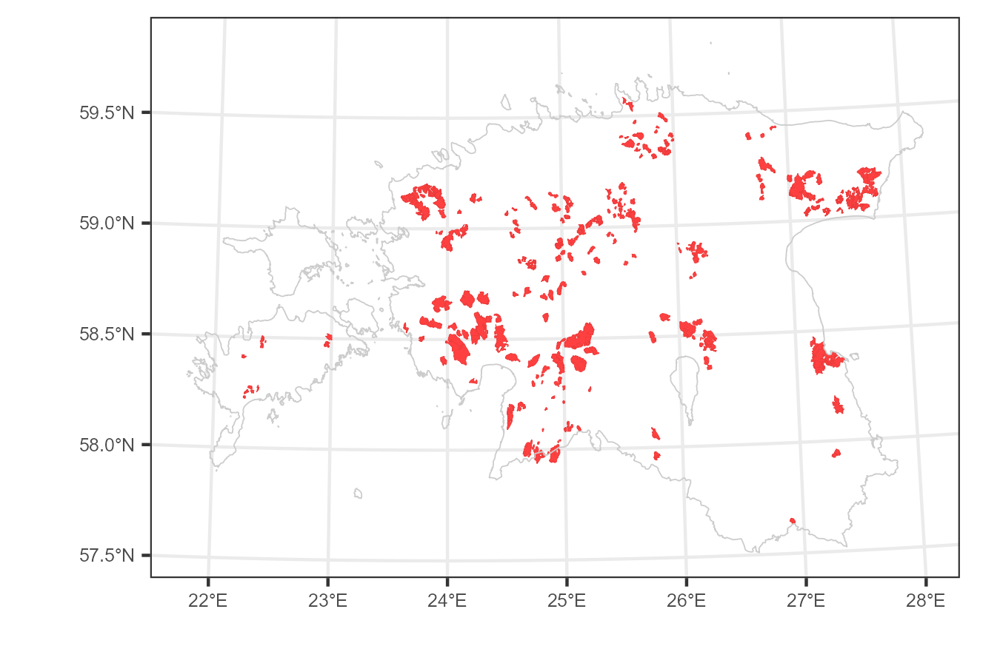
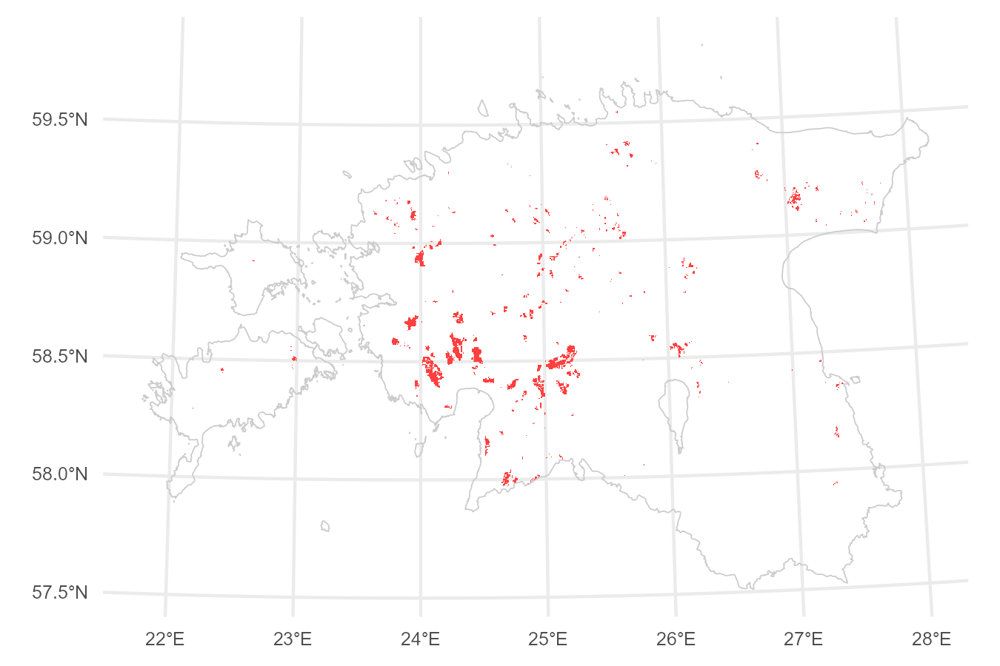
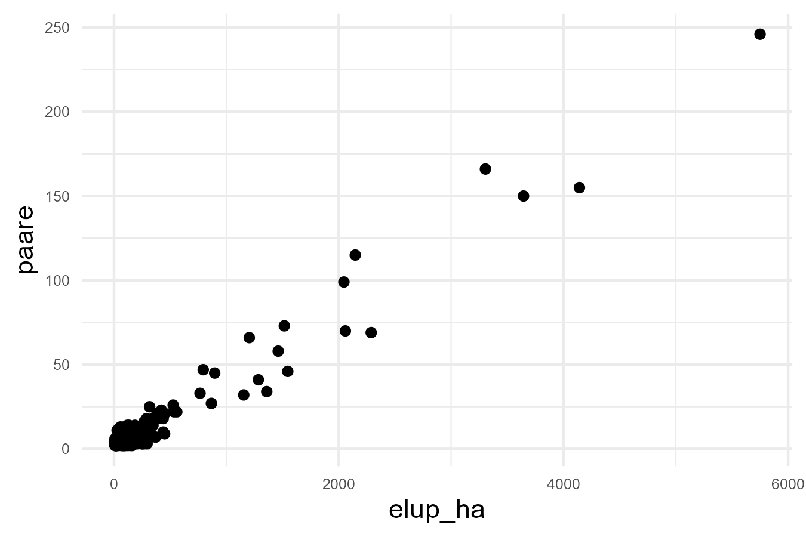

```{r setup, include=FALSE}
knitr::opts_chunk$set(
  echo = FALSE,
  fig.path = "fig/",
  dev = "png"
  )

# loading packages
library(sf)
#library(geos)
library(units)
library(tidyverse)
library(lubridate)
library(ggrepel)
library(readxl)
library(scales)
library(pals)
#library(terra)
#library(ggpubr)
library(RColorBrewer)
#library(tidyterra)
#library(xml2)
#library(XML)
library(kableExtra)
#library(flextable)
#library(ftExtra)

options(dplyr.summarise.inform=FALSE)
options(warn=-1)


eesti<-st_read("ref/taust.gpkg", "eesti", quiet=T)
ebi<-read_excel("ref/Eesti linnud 20250211.xlsx") %>%
  select(`3+3`,nimi_ek,ladnimi, selts_lk, selts_ek, sugukond_lk, sugukond_ek)%>%
  mutate(liik=tolower(`3+3`), ord=1:nrow(.))

arvymard<-function(x) {
  y <- case_when(
    x <= 200 ~ round(x,0),
    x >200 & x<=2000 ~ 10*round(x/10,0),
    x >2000 & x<=20000 ~ 100*round(x/100,0),
    x >20000 & x<=200000 ~ 1000*round(x/1000,0),
    x >200000 ~ 1e4*round(x/1e4,0),
    TRUE ~ x
  )
  return(y)
}

slsj <- st_read("src/PR0101_sj_n399_ar.shp")

agr <- read_csv2("src/PR0101_agregeeritud_seireandmed.csv")


p <- slsj %>%
  filter(!is.na(aastad) & !aastad=="") %>%
  #st_centroid() %>%
  ggplot() +
  geom_sf(color="brown2", fill="brown1", linewidth=0.1) +
  #geom_sf(aes(fill=viimane))+
  geom_sf(data=eesti, fill=NA, color="#CCCCCC") +
  #geom_text_repel(data = trid, aes(x = x, y = y, label = transekt), size=2.5, nudge_x = c(1, -1.5, 2, 2, -1), nudge_y = c(0.25,-0.25, 0.5, 0.5, -0.5)) +
  theme_bw() + xlab("") + ylab("")+
  theme(legend.title = element_blank(), legend.text=element_text(size=6), axis.text=element_text(size=6))
ggsave("fig/pr0101_sj.png", width=4.5, height=3, bg="white")

```

## Metoodika

Soolindude seire ehk ametliku nimetusega haudelindude koosluste seire (madalsood ja rabad) on elustiku mitmekesisuse seireprogrammi üks osa. Seiremetoodika kirjeldus on leitav Keskkonnaagentuuri seireankeetide lehelt: https://keskkonnaagentuur.ee/seireankeedid. Soode haudelindude seire on "inventuuri"-laadne seire, kus enamikku seirealasid kordusseiratakse ca 9-12 aasta tagant. Nigula rabas toimub haudelindude seire iga-aastaselt, alates aastast 1968.  

<figure>
  
  <figcaption><b>Joonis.</b> Programmi PR0101 seirealad. Need ei sisalda veel 2023 ja 2024 kevadel esmakordselt uuritud soid, mis asuvad Hiiumaal ja </figcaption>
</figure>

Soode haudelinde seiratakse pesitsusterritooriume kaardistades, liikudes eelnevalt kindlaks määratud loendusrada ehk transekti mööda. Kogu soomassiiv kaetakse transektidega, mis paigutatakse regulaarse intervalliga, reeglina 400 m vahega (loendusriba laius 200+200 m). Puisemates sookooslustes kasutatakse kitsamat transektivahemikku (nt Avaste soos 300 m ehk 150+150 m) ning mõnedel täiesti lagedatel soodel laiemat transektivahemikku (nt Elbu rabal ja Kuresoo lääneosal 500 m ehk 250+250 m). Järgmisel seirekorral kasutatakse tulemuste võrreldavuse tagamiseks samu transekte.

Arvukuse hinnangud anti kolmel meetodil:

* Viimase seirekorra loendustulemuse põhjal
* Arvukusmudeli (TRIM) põhjal
* Uurimata elupaigaga parandatud ehk elupaigamudeli ekstrapoleeringu põhjal

Arvukuse ja trendide hindamiseks kasutati `R` [@r] laiendust `rtrim` [@rtrim]. Andmed laeti keskkonnaseire infosüsteemist KESE (https://kese.envir.ee), kus II taseme näitajate vormil (https://kese.envir.ee/kese/AggregatedParameterValueLink) kasutati järgnevat päringut.

* Seireprogramm **Haudelindude kooslused (madalsood ja rabad)**
* Seireaasta **1986-2022**
* Näitaja kood **N2002237**


## Tulemused

### Arvukus

#### Viimase loenduse põhine hinnang

Viimase loendustulemuse põhjal saadud arvukused on toodud järgnevas tabelis. Siin on käsitletud vaid liike, kelle üldarvukus viimastel andmetel oli vähemalt 10 pesitsuspaari.

<p><b>Tabel.</b> Arvukamate soolindude koondarvukused viimase loenduse põhjal.</p>
```{r arvviimane, echo=F}
viimane <- agr %>% group_by(`Seirekoha KKR`) %>%
  summarise(Seireaeg=max(Seireaeg)) %>%
  left_join(agr %>% select(`Seirekoha KKR`, Seireaeg, `Liik/takson (lad)`, `Mõõdetud arvväärtus`), by=c("Seirekoha KKR", "Seireaeg"))

viimane1<-viimane %>%
  group_by(`Liik/takson (lad)`) %>%
  summarise(loendus=sum(`Mõõdetud arvväärtus`)) %>%
  rename(liik=`Liik/takson (lad)`) %>%
  arrange(desc(loendus))

viimane1 %>%
  left_join(ebi %>% select(nimi_ek, ladnimi, ord) %>% rename(liik=ladnimi), by="liik") %>%
  filter(
    liik%in%c(
      "Pluvialis apricaria",
      "Lyrurus tetrix",
      "Vanellus vanellus",
      "Tringa glareola",
      "Gallinago gallinago",
      "Larus canus",
      "Tringa totanus",
      "Numenius phaeopus",
      "Bucephala clangula",
      "Anas platyrhynchos",
      "Limosa limosa",
      "Lanius collurio",
      "Tringa nebularia",
      "Turdus viscivorus",
      "Numenius arquata",
      "Anas crecca",
      "Calidris pugnax",
      "Lanius excubitor",
      "Chroicocephalus ridibundus",
      "Aythya fuligula",
      "Hydrocoloeus minutus",
      "Circus pygargus",
      "Larus argentatus",
      "Cygnus cygnus",
      "Circus aeruginosus",
      "Podiceps auritus",
      "Calidris alpina schinzii",
      "Charadrius dubius",
      "Spatula clypeata",
      "Chlidonias niger",
      "Lagopus lagopus",
      "Mareca penelope"
    )
  ) %>%
  arrange(-desc(ord)) %>%
  mutate(
    Liik=paste0(nimi_ek," <i>",liik,"</i>"),
    loendus=as.integer(loendus)
  ) %>%
  select(Liik,loendus) %>%
  rename(Loendus=loendus) %>%
  #kbl(booktabs = T, escape=F) %>%
  #kable_classic(full_width = FALSE) %>%
  #kable_styling(full_width = T, font_size =8, fixed_thead = T)
  #kable_styling(font_size =8, fixed_thead = T)
  #kable(escape=F)
  kbl("pipe", escape=F)
```


#### Arvukusmudeli põhine hinnang

Arvukusmudel sobitati lühiajalise trendiperioodi puhul 12-aastasele andmeperioodile, kus viimane aasta oli vaatluste viimane aasta. Pika-ajalise trendiperioodi puhul päriti andmed alates aastast 1980. Kuna seire toimub valdavalt intervalliga, siis kasutati lõhiajalise perioodi puhul mudeli tüüpi 1 (lineaarne mudel), koos ülehajumise arvestusega (overdisp=TRUE) ja ilma jadakorrelatsiooni arvestuseta (serialcor=FALSE).

`trim(count~site+year, data=data, model=1, overdisp=T, serialcor=F)`

Arvukused hinnati arvukusmudeli prognoositud üldarvukusest (funktsioon `totals`).

`totals(m, which="imputed", level=0.95)`

Viimase 6 aasta perioodi üldhinnangute 95%-vahemike põhjal hinnati pesitsusasurkonna suurus. Miinimumina arvestati 6-aastase tsükli 95%-usaldusvahemike miinimum ning maksimumiks 6-aastase tsükli 95%-usaldusvahemike maksimum. Arvukusmudelite sobitusprotseduur on kirjeldatud koodis "R/01-rtrimstrata.R" ning selle tulemused on väljastatud faili "result/spstrata-20250310-1.RData". Viimane sisaldab kolme objekti:

**overalls**
: Arvukuse trendihinnangud lühiajalise (ST) ja pika-ajalise (LT) perioodi kohta.

**indices**
: Arvukuse indeksid aastati.

**totals**
: Üldarvukused aastati.

<p><b>Tabel.</b> Arvukamate soolindude koondarvukused viimases 6-aastases tsüklis arvukusmudeli põhjal (ainult viimase 12 aasta andmed).</p>
```{r arvftrimst, echo=F}
load("result/spstrata-20250312-1.RData")

totals %>%
  filter(Periood=="ST") %>%
  select(-Periood) %>%
  group_by(Liik) %>%
  slice_max(order_by=time, n=6) %>%
  group_by(Liik) %>%
  summarise(min=min(lo), max=max(hi), Periood=paste0(min(time),"-",max(time))) %>%
  rename(liik=Liik) %>%
  left_join(ebi %>% select(nimi_ek, ladnimi, ord) %>% rename(liik=ladnimi), by="liik")  %>%
  arrange(-desc(ord)) %>%
  mutate(
    smin=arvymard(min),
    smax=arvymard(max),
    Hinnang=paste0(smin,"..",smax),
    Liik=paste0(nimi_ek," <i>",liik,"</i>")
  ) %>%
  select(Liik, Periood, Hinnang) %>%
  #kable(escape=F)
  kbl("pipe", escape=F)
```
</br>


<p><b>Tabel.</b> Arvukamate soolindude koondarvukused viimases 6-aastases tsüklis arvukusmudeli põhjal (andmed alates 1980).</p>
```{r arvftrimlt, echo=F}

totals %>%
  filter(Periood=="LT") %>%
  select(-Periood) %>%
  group_by(Liik) %>%
  slice_max(order_by=time, n=6) %>%
  group_by(Liik) %>%
  summarise(min=min(lo), max=max(hi), Periood=paste0(min(time),"-",max(time))) %>%
  rename(liik=Liik) %>%
  left_join(ebi %>% select(nimi_ek, ladnimi, ord) %>% rename(liik=ladnimi), by="liik")  %>%
  arrange(-desc(ord)) %>%
  mutate(
    smin=arvymard(min),
    smax=arvymard(max),
    Hinnang=paste0(smin,"..",smax),
    Liik=paste0(nimi_ek," <i>",liik,"</i>")
  ) %>%
  select(Liik, Periood, Hinnang) %>%
  #kable(escape=F)
  kbl("pipe", escape=F)
```
</br>


#### Uurimata elupaigaga parandatud hinnang

Uurimata elupaiga korrektsiooni leidmine toimub järgnevates etaappides:

* Elupaiga esinemiskaardi leidmine
* Elupaiga kogupindala ja elupaiga asurkonna suuruse vahelise seose hindamine
* Uurimata elupaigalaikude leidmine ning nende asurkonna suuruse prognoos

Elupaiga esinemiskaart arvutati liigi elupaiga prognooskaardist. Prognooskaarti kalibreeriti 2019-2022 vaatlustega. Esinemis- ja puudumisandmed genereeriti tausta, loendustransektide ja vaatluste põhjal. Kui pikslis oli liigi vaatlus, siis omistati pikslile kontrollväärtus 1 (esinemine). Puudumised (N $\sim$ esinemiste arv) genereeriti vaatluste ruumi põhjal, millele lisati transektidega lõikuvad pikslid ning millest eemaldati territooriumite lähedusse (r=300 m) jäävad pikslid. Kasutati unikaalseid piksleid. Saadud pikslitele omistati kontrollväärtus 0 (puudumine). Järgnevalt teostati kalibratsioonanalüüs [@presenceabsence], kus võrreldi mudelprognoosi (piksli elupaigaprognoos, vahemikus 0..1) ning pikslile omistatud kontrollväärtust (0 või 1). Kalibratsioonanalüüsil hinnati esinemislävendi väärtus tingimusel, mille puhul tundlikkuse (õietiennustatud esinemiste) ja spetsiifilisuse (õietiennustatud puudumiste) summa on maksimaalne. Teisisõnu tähendab see seda, et esinemiste ja puudumiste veamäärade keskmised on minimaalsed.


##### Rüüt *Pluvialis apricaria*

```{r}
#load("result/slsp-pluapr.RData")
#opt<-optimal.thresholds(slspvalid, opt.methods=3)
load("result/slspelupvarv-1-10-100ha-20250313.Rdata")
```

<figure>
  
  <figcaption><b>Joonis.</b> Elupaiga esinemise tõenäosust (0..1) kirjeldav prognooskaart.</figcaption>
</figure>

Kalibratsioonanalüüsil hinnatud esinemislävendi abil (rüüda puhul 0,56) teisendatakse prognooskaart elupaiga esinemiskaardiks.

<figure>
  
  <figcaption><b>Joonis.</b> Elupaiga esinemine.</figcaption>
</figure>

Viimase põhjal arvutatakse seirealadele elupaiga pindala ning võrreldakse seda loendatud paaride arvuga.

<figure>
  
  <figcaption><b>Joonis.</b> Elupaiga pindala seirealal (elup_ha) ning seireala asurkonna suurus (paare).</figcaption>
</figure>

Seos seireala asurkonna suurusega (paaride arv) ja seirealal oleva elupaiga pindalaga on enam-vähem lineaarne.

...

Mudeli põhjal prognoositi elupaigalaikudele nende tõenäoline asurkonna suurus. Kuna elupaigamudel ei arvesta elupaiga suurusega, siis sisaldab sel viisil saadud elupaiga prognoos väga palju väikesepinnalisi elupaiku, mis suure tõenäosusega on sobimatud. Hetkel arvestame parandi hindamisel vaid elupaigalaikudega, mille kogupindala on vähemalt 100 ha.

<figure>
  
  <figcaption><b>Joonis.</b> Uurimata elupaikade paiknemine.</figcaption>
</figure>
</br>

<p><b>Tabel.</b> Uurimata elupaigalaikude minimaalse pindala lävendile vastav paaride arv.</p>
```{r}
slspelupvarv %>%
  filter(liik=="pluapr") %>%
  mutate(across(3:5,~arvymard(.x))) %>%
  select(-liik) %>%
  rename(`Lävend [ha]`=eluphalavend, `2,5%`=N1, `50%`=N2, `97,5%`=N3) %>%
  #kable(escape=F)
  kbl("pipe", escape=F)
```


Sarnane arvutuskäik on läbitud arvukamate sookahlajate ning hallõgija kohta. Tulemused kolme lävendil on esitatud allolevas tabelis.

<p><b>Tabel.</b> Uurimata elupaigalaikude pindala lävendile vastav paaride arv.</p>
```{r}
slspelupvarv %>%
  filter(eluphalavend==100) %>%
  left_join(ebi %>% select(liik, nimi_ek, ladnimi, ord), by="liik")  %>%
  arrange(-desc(ord)) %>%
  mutate(across(3:5,~arvymard(.x))) %>%
  select(-liik) %>%
  rename(`Lävend [ha]`=eluphalavend, `2,5%`=N1, `50%`=N2, `97,5%`=N3) %>%
  mutate(
    Liik=paste0(nimi_ek," <i>",ladnimi,"</i>")
  ) %>%
  select(Liik, `Lävend [ha]`, `2,5%`, `50%`, `97,5%`) %>%
  #kable(escape=F)
  kbl("pipe", escape=F)
```

<p><b>Tabel.</b> Uurimata elupaigalaikude pindala lävendile vastav paaride arv.</p>
```{r}
slspelupvarv %>%
  filter(eluphalavend==10) %>%
  left_join(ebi %>% select(liik, nimi_ek, ladnimi, ord), by="liik")  %>%
  arrange(-desc(ord)) %>%
  mutate(across(3:5,~arvymard(.x))) %>%
  select(-liik) %>%
  rename(`Lävend [ha]`=eluphalavend, `2,5%`=N1, `50%`=N2, `97,5%`=N3) %>%
  mutate(
    Liik=paste0(nimi_ek," <i>",ladnimi,"</i>")
  ) %>%
  select(Liik, `Lävend [ha]`, `2,5%`, `50%`, `97,5%`) %>%
  #kable(escape=F)
  kbl("pipe", escape=F)
```


### Arvukuse trend

<p><b>Tabel.</b> Arvukamate soolindude lühiajalised (12 aastat) arvukuse trendid.</p>
```{r arvtrendst, echo=F}
#load("result/spstrata-20250310-1.RData")
overalls %>% 
  filter(Periood=="ST") %>%
  select(Liik,from,upto,mul,se_mul,meaning) %>%
  rename(liik=Liik) %>%
  left_join(ebi %>% select(nimi_ek, ladnimi, ord) %>% rename(liik=ladnimi), by="liik")  %>%
  arrange(-desc(ord)) %>%
  mutate(
    Periood=paste(from,upto,sep="-"),`Perioodi pikkus`=upto-from+1,
    `CV%`=formatC(100*se_mul/mul,digits=2,format="f",dec=","),
    Tõusukordaja=formatC(mul,digits=3,dec=",",format="f"),
    `Tõusukordaja (CV%)`=paste(Tõusukordaja," (",`CV%`,")",sep=""),
    Trendiklass=gsub("[(p<0.05)]","",meaning),
    Trendiklass=gsub("[(p<0.01)]","",Trendiklass),
    Trendiklass=recode(Trendiklass,
                  "Strong increase "="tugev kasv",
                  "Moderate increase "="mõõdukas kasv",
                  "Moderate decrease "="mõõdukas langus",
                  "Strong decrease "="tugev langus",
                  "Uncertain"="ebaselge",
                  "Stable"="stabiilne"
                ),
    muut1=round(12*100*((mul-1.96*se_mul-1)),0), muut2=round(12*100*((mul+1.96*se_mul-1)),0),
    Muutus=paste0(muut1, "..", muut2),
    Liik=paste0(nimi_ek," <i>",liik,"</i>")
  ) %>%
  select(Liik, Periood, `Tõusukordaja (CV%)`, Trendiklass, Muutus) %>%
  #kable(escape=F)
  kbl("pipe", escape=F)
```
</br>


<p><b>Tabel.</b> Arvukamate soolindude pika-ajalised (alates 1980) arvukuse trendid.</p>
```{r arvtrendlt, echo=F}
overalls %>% 
  filter(Periood=="LT") %>%
  select(Liik,from,upto,mul,se_mul,meaning) %>%
  rename(liik=Liik) %>%
  left_join(ebi %>% select(nimi_ek, ladnimi, ord) %>% rename(liik=ladnimi), by="liik")  %>%
  arrange(-desc(ord)) %>%
  mutate(
    Periood=paste(from,upto,sep="-"),`Perioodi pikkus`=upto-from+1,
    `CV%`=formatC(100*se_mul/mul,digits=2,format="f",dec=","),
    Tõusukordaja=formatC(mul,digits=3,dec=",",format="f"),
    `Tõusukordaja (CV%)`=paste(Tõusukordaja," (",`CV%`,")",sep=""),
    Trendiklass=gsub("[(p<0.05)]","",meaning),
    Trendiklass=gsub("[(p<0.01)]","",Trendiklass),
    Trendiklass=recode(Trendiklass,
                  "Strong increase "="tugev kasv",
                  "Moderate increase "="mõõdukas kasv",
                  "Moderate decrease "="mõõdukas langus",
                  "Strong decrease "="tugev langus",
                  "Uncertain"="ebaselge",
                  "Stable"="stabiilne"
                ),
    Liik=paste0(nimi_ek," <i>",liik,"</i>"),
    muut1=round(12*100*((mul-1.96*se_mul-1)),0), muut2=round(12*100*((mul+1.96*se_mul-1)),0),
    Muutus=paste0(muut1, "..", muut2)
  ) %>%
  select(Liik, Periood, `Tõusukordaja (CV%)`, Trendiklass, Muutus) %>%
  #kable(escape=F)
  kbl("pipe", escape=F)
```


## Kokkuvõte

#### Rüüt *Pluvialis apricaria*
Kuna seirealade arvukus on antud ühekordse loenduse põhjal ning sisaldab ka vaatleja märkamiskaugusest tulenevat alahinanngut, siis seirealade arvukus ning arvukusmudeli hinnangud on tõenäoliselt alahinnangud. Varem on tulemust korrigeeritud 30% lisamisega. Kuna 2013-2024 loendusandmed, mille põhjal on saadud lühiajalise arvukusmudeli hinnangud, ei sisalda kõiki loendustulemusi, annab ka lühiajaline arvukusmudel viimase 6 aasta arvukuse teatava alahinannguga. Seetõttu on rüüda puhul mõistlik kasutada pika-ajalist arvukusmudelit, mis annab viimase 6-aasta arvukuseks 2300-2700 paari. Lisades sellele uurimata elupaiga asurkonna suuruse (0-20 paari) ning korrigeerides tulemust 30%-ga, saame lõplikuks arvukushinnanguks **`r paste(arvymard(c(2300,2720)*1.3), collapse="-")` paari**. Lühiajaline arvukuse trend (2013-2024) hinnati **stabiilseks** ning arvukuse muutust lühiajalises perioodis hinnati vahemikku **0..5%**.

```{r}
p<-totals %>% 
  filter(Liik=="Pluvialis apricaria" & Periood=="LT") %>%
  ggplot()+
  geom_errorbar(aes(x=time,ymin=lo,ymax=hi), color="#cccccc")+
  geom_point(aes(x=time,y=imputed))+
  theme_minimal()+theme(axis.title=element_blank(), axis.text=element_text(size=6))
  ggsave(paste0("fig/slsj-pluapr-lt-totals.png"), p, width=4.5, height=2, bg="white")
```


#### Väikekoovitaja *Numenius phaeopus*
Väikekoovitajad on loenduste ajal väga liikuvad, mistõttu võib pelgalt vaatluste põhjal asustustiheduste arvutamine anda ülehinnanguid. Seetõttu väikekoovitaja arvukust ei korrigeerita, ega arvestata ka vaatleja märkamiskaugusest tulenevat võimalikku alahinanngut. Ka uurimata elupaikadest ei lisandu suure tõenäosusega arvestammata pesitsuspaare. Väikekoovitaja puhul kasutame lühiajalisest arvukusmudelist saadud hinnangut, mis on **`r paste(arvymard(c(510,680)), collapse="-")` paari**. Lühiajaline arvukuse trend (2013-2024) hinnati **stabiilseks** ning arvukuse muutust lühiajalises perioodis hinnati vahemikku **-2..5%**.


#### Suurkoovitaja *Numenius arquata*
Suurkoovitajad on samuti loenduste ajal väga liikuvad ning häälekad. Seetõttu tuleb kõiki vaatlusi koos liikumissuundade ja käitumisega seireala loendustulemuse hindamisel hoolikalt arvestada. Sellest tulenevalt ei korrigeerita ka suurkoovitaja arvukust. Lühajalise perioodi arvukusmudel annab meile viimase 6 aasta arvukuse vahemikuks 280-400 paari. Tõenäoliselt ei sisaldu selles mõningaid olulisi suurkoovitaja seirealasid, mistõttu tuleb hinanng veidi suurem - 340-770 paari. Uurimata elupaikadest lisandub 0-35 pesitsuspaari. Võttes need andmed kokku, anname suurkoovitaja soode asurkonna suuruseks **`r paste(arvymard(c(280+0,400+35)), collapse="-")` paari**. Lühiajaline arvukuse trend (2013-2024) hinnati **tõusvaks** ning arvukuse muutust lühiajalises perioodis hinnati vahemikku **1..7%**.

Antud hinnang kehtib soodes pesitseva asurkonna kohta, mistõttu Eesti hinangu saamisek tuleb siia lisada kultuurmaadel pesitseva asurkonna hinnang. Transektloenduste andmete analüüsil (atlas+soome+sood) saadi suurkoovitaja hinnanguks 1080-1390 paari. TUlemus vajab veel verifitseerimist teiste meetoditega, kuid on kahtlemata lähedasem hinnang kui soode oma.

#### Mustsaba-vigle *Limosa limosa*
Mustsaba-vigle tuumikasurkond jaguneb 5 rannikulähedase raba peale: Linnuraba, Marimetsa raba, Lihula raba, Võlla raba ning Laisma raba. Mujal esineb liiki vähemarvukamalt. Viimastel aastatel on vigled asustanud ka sisemaa soid (nt Keava raba 2022), mis viitab sisemaa jätkuvale koloniseerimisele. Ka vustsaba vigle on loendustel väga liikuv ning häälekas, mistõttu vaatlusandmete põhine hinnang ilma territooriumiteks tõlgenduseta annab tõenäoliselt seireala kohta ülehinanngu. Seetõttu ei korrigeerita ka vigle seirealade paaride arvu hinnanguid. Lühajalise perioodi arvukusmudel annab meile viimase 6 aasta arvukuse vahemikuks 400-600 paari. Pika-ajaline arvukusmudel annab viimase 6 aasta arvukuseks 410-1540 paari. Tunduvalt suurem ülempiir tuleneb ilmselt sellest, et lühiajalise perioodi puhul on kasutusel lineaarne mudel ning pika-ajalise perioodi puhul käänupunktidega mudel. Viimase puhul võib esineda ebaharilikke väljalööke juhul kui seireaastal on valimis seireala, kus on väga suur arvukus võrreldes iga-aastaselt seires olnud seirealadega. Seetõttu tuleks kasutada lühiajalise mudeli hinanngut. Uurimata elupaikadest lisandub 0-115 ehk ümardatult 30-120 pesitsuspaari. Võttes need andmed kokku, anname mustsaba-vigle soode asurkonna suuruseks **`r paste(arvymard(c(400+0,600+115)), collapse="-")` paari**. Lühiajaline arvukuse trend (2013-2024) hinnati **stabiilseks** ning arvukuse muutust lühiajalises perioodis hinnati vahemikku **-1..8%**.

#### Mudatilder *Tringa glareola*
Lühiajalise perioodi arvukusmudel annab viimase 6 aasta arvukuseks 1190-1460 paari. Mudatildri puhul kasutame sobiva elupaiga lävendina 10 ha, mis annab uurimata elupaiga asurkonna prognoosiks 0-710 paari. Võttes need hinnangud kokku, on mudatildri pesitsusasurkonna suuruse hinnanguks **`r paste(arvymard(c(1190+0,1460+710)), collapse="-")` paari**. Lühiajaline arvukuse trend (2013-2024) hinnati **langevaks** ning arvukuse muutust lühiajalises perioodis hinnati vahemikku **-4..0%**.

#### Heletilder *Tringa nebularia*
Lühiajalise perioodi arvukusmudel annab viimase 6 aasta arvukuseks 340-450 paari. Uurimata elupaiga asurkonna prognoosiks saadi 0-152 paari, mis on tõenäoliselt ülehinnang, kuna ei arvesta liigi põhja- ja kirdepoolse levimusega. Jättes uurimata elupaiga arvestamata, anname heletildri pesitsusasurkonna suuruse hinnanguks **340-450 paari**. Lühiajaline arvukuse trend (2013-2024) hinnati **stabiilseks** ning arvukuse muutust lühiajalises perioodis hinnati vahemikku **-1..0%**.

#### Hallõgija *Lanius excubitor*
Lühiajalise perioodi arvukusmudelit ei õnnestunud sobitada, mistõttu tuleb tugineda viimase loenduse arvukusele, milleks saadi 230 paari. Hallõgija puhul kasutame sobiva elupaiga lävendina 100 ha, mis annab uurimata elupaiga asurkonna prognoosiks 1-18 paari. VÕttes need andmed kokku, saame hallõgija pesitsusasurkonna arvukushinannguks **`r paste(arvymard(c(230+1,230+18)), collapse="-")` paari**.


## Kasutatud allikad

