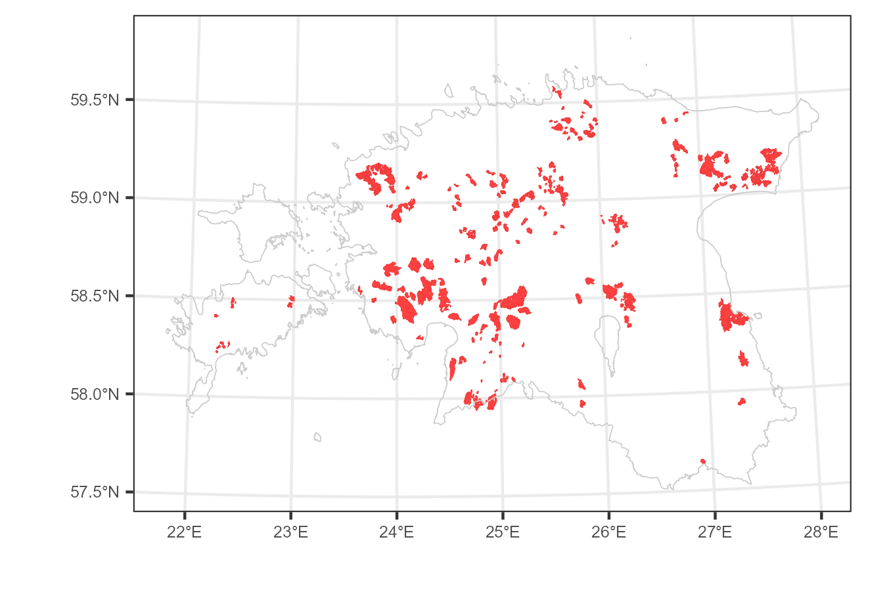
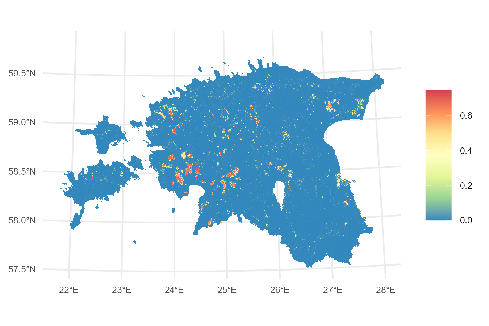
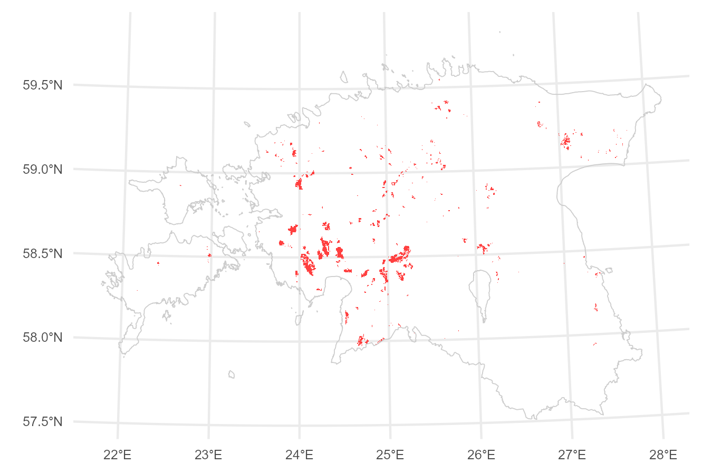
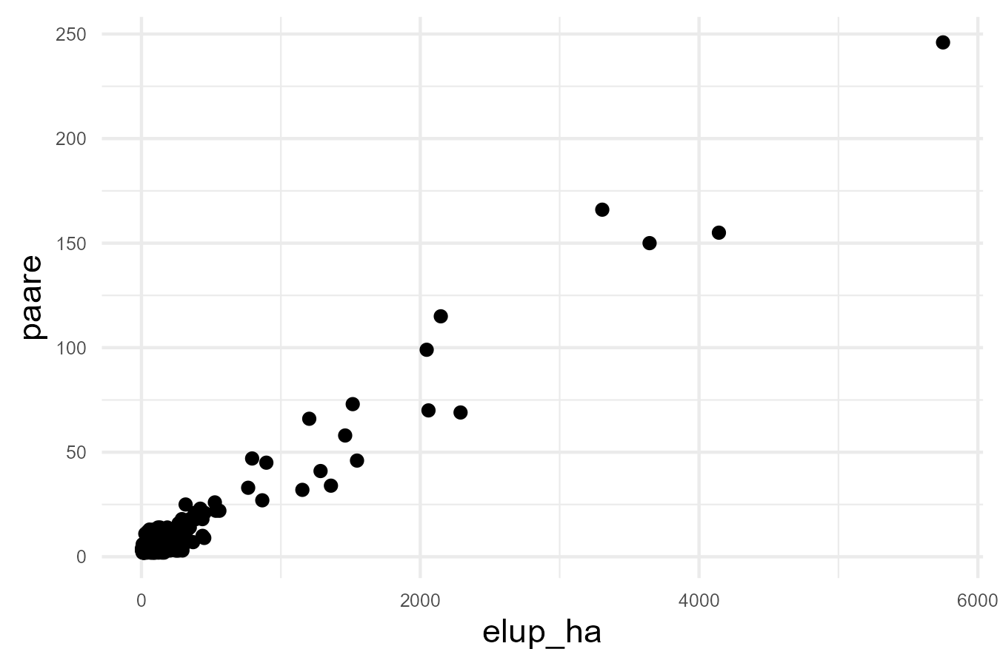
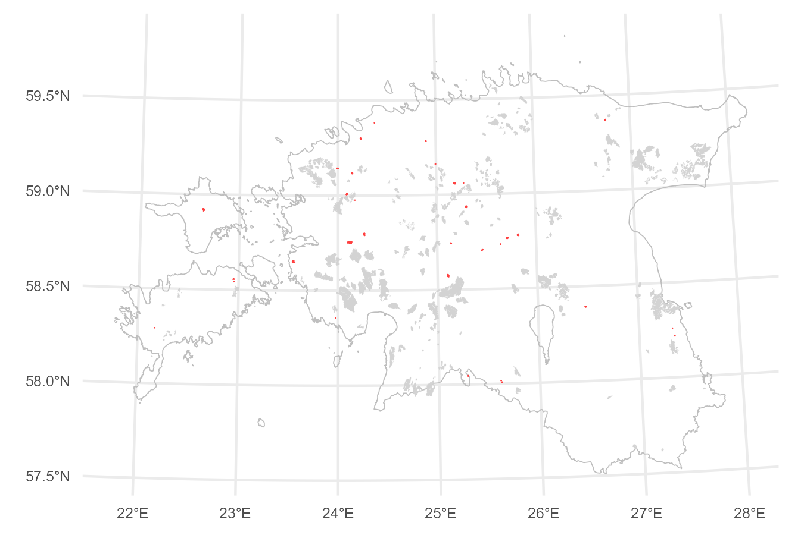

Soolindude arvukus ja levik
================

## Metoodika

Soolindude seire ehk ametliku nimetusega haudelindude koosluste seire
(madalsood ja rabad) on elustiku mitmekesisuse seireprogrammi üks osa.
Seiremetoodika kirjeldus on leitav Keskkonnaagentuuri seireankeetide
lehelt: <https://keskkonnaagentuur.ee/seireankeedid>. Soode haudelindude
seire on “inventuuri”-laadne seire, kus enamikku seirealasid
kordusseiratakse ca 9-12 aasta tagant. Nigula rabas toimub haudelindude
seire iga-aastaselt, alates aastast 1968.

<figure>

<figcaption>
<b>Joonis.</b> Programmi PR0101 seirealad. Need ei sisalda veel 2023 ja
2024 kevadel esmakordselt uuritud soid, mis asuvad Hiiumaal ja
</figcaption>
</figure>

Soode haudelinde seiratakse pesitsusterritooriume kaardistades, liikudes
eelnevalt kindlaks määratud loendusrada ehk transekti mööda. Kogu
soomassiiv kaetakse transektidega, mis paigutatakse regulaarse
intervalliga, reeglina 400 m vahega (loendusriba laius 200+200 m).
Puisemates sookooslustes kasutatakse kitsamat transektivahemikku (nt
Avaste soos 300 m ehk 150+150 m) ning mõnedel täiesti lagedatel soodel
laiemat transektivahemikku (nt Elbu rabal ja Kuresoo lääneosal 500 m ehk
250+250 m). Järgmisel seirekorral kasutatakse tulemuste võrreldavuse
tagamiseks samu transekte.

Arvukuse hinnangud anti kolmel meetodil:

- Viimase seirekorra loendustulemuse põhjal
- Arvukusmudeli (TRIM) põhjal
- Uurimata elupaigaga parandatud ehk elupaigamudeli ekstrapoleeringu
  põhjal

Arvukuse ja trendide hindamiseks kasutati `R` (R Core Team 2020)
laiendust `rtrim` (Bogaart, van der Loo, and Pannekoek 2020). Andmed
laeti keskkonnaseire infosüsteemist KESE (<https://kese.envir.ee>), kus
II taseme näitajate vormil
(<https://kese.envir.ee/kese/AggregatedParameterValueLink>) kasutati
järgnevat päringut.

- Seireprogramm **Haudelindude kooslused (madalsood ja rabad)**
- Seireaasta **1986-2022**
- Näitaja kood **N2002237**

## Tulemused

### Arvukus

#### Viimase loenduse põhine hinnang

Viimase loendustulemuse põhjal saadud arvukused on toodud järgnevas
tabelis. Siin on käsitletud vaid liike, kelle üldarvukus viimastel
andmetel oli vähemalt 10 pesitsuspaari.

<b>Tabel.</b> Arvukamate soolindude koondarvukused viimase loenduse
põhjal.

| Liik                                                   | Loendus |
|:-------------------------------------------------------|--------:|
| laululuik <i>Cygnus cygnus</i>                         |      37 |
| luitsnokk-part <i>Spatula clypeata</i>                 |      13 |
| viupart <i>Mareca penelope</i>                         |      10 |
| sinikael-part <i>Anas platyrhynchos</i>                |     509 |
| piilpart <i>Anas crecca</i>                            |     284 |
| tuttvart <i>Aythya fuligula</i>                        |     121 |
| sõtkas <i>Bucephala clangula</i>                       |     561 |
| rabapüü <i>Lagopus lagopus</i>                         |      10 |
| teder <i>Lyrurus tetrix</i>                            |    1542 |
| sarvikpütt <i>Podiceps auritus</i>                     |      29 |
| kiivitaja (harilik kiivitaja) <i>Vanellus vanellus</i> |    1488 |
| rüüt <i>Pluvialis apricaria</i>                        |    2598 |
| väiketüll <i>Charadrius dubius</i>                     |      15 |
| väikekoovitaja <i>Numenius phaeopus</i>                |     604 |
| suurkoovitaja <i>Numenius arquata</i>                  |     383 |
| mustsaba-vigle <i>Limosa limosa</i>                    |     497 |
| tutkas <i>Calidris pugnax</i>                          |     251 |
| niidurüdi <i>Calidris alpina schinzii</i>              |      27 |
| tikutaja (taevasikk) <i>Gallinago gallinago</i>        |    1283 |
| punajalg-tilder <i>Tringa totanus</i>                  |     679 |
| mudatilder <i>Tringa glareola</i>                      |    1399 |
| heletilder <i>Tringa nebularia</i>                     |     399 |
| naerukajakas <i>Chroicocephalus ridibundus</i>         |     188 |
| väikekajakas <i>Hydrocoloeus minutus</i>               |     108 |
| kalakajakas <i>Larus canus</i>                         |     705 |
| hõbekajakas <i>Larus argentatus</i>                    |      43 |
| mustviires <i>Chlidonias niger</i>                     |      12 |
| roo-loorkull <i>Circus aeruginosus</i>                 |      29 |
| soo-loorkull <i>Circus pygargus</i>                    |      85 |
| punaselg-õgija <i>Lanius collurio</i>                  |     438 |
| hallõgija <i>Lanius excubitor</i>                      |     230 |
| hoburästas <i>Turdus viscivorus</i>                    |     390 |

#### Arvukusmudeli põhine hinnang

Arvukusmudel sobitati lühiajalise trendiperioodi puhul 12-aastasele
andmeperioodile, kus viimane aasta oli vaatluste viimane aasta.
Pika-ajalise trendiperioodi puhul päriti andmed alates aastast 1980.
Kuna seire toimub valdavalt intervalliga, siis kasutati lõhiajalise
perioodi puhul mudeli tüüpi 1 (lineaarne mudel), koos ülehajumise
arvestusega (overdisp=TRUE) ja ilma jadakorrelatsiooni arvestuseta
(serialcor=FALSE).

`trim(count~site+year, data=data, model=1, overdisp=T, serialcor=F)`

Arvukused hinnati arvukusmudeli prognoositud üldarvukusest (funktsioon
`totals`).

`totals(m, which="imputed", level=0.95)`

Viimase 6 aasta perioodi üldhinnangute 95%-vahemike põhjal hinnati
pesitsusasurkonna suurus. Miinimumina arvestati 6-aastase tsükli
95%-usaldusvahemike miinimum ning maksimumiks 6-aastase tsükli
95%-usaldusvahemike maksimum. Arvukusmudelite sobitusprotseduur on
kirjeldatud koodis “R/01-rtrimstrata.R” ning selle tulemused on
väljastatud faili “result/spstrata-20250310-1.RData”. Viimane sisaldab
kolme objekti:

**overalls**  
Arvukuse trendihinnangud lühiajalise (ST) ja pika-ajalise (LT) perioodi
kohta.

**indices**  
Arvukuse indeksid aastati.

**totals**  
Üldarvukused aastati.

<b>Tabel.</b> Arvukamate soolindude koondarvukused viimases 6-aastases
tsüklis arvukusmudeli põhjal (ainult viimase 12 aasta andmed).

| Liik | Periood | Hinnang |
|:---|:---|:---|
| sinikael-part <i>Anas platyrhynchos</i> | 2019-2024 | 350..540 |
| piilpart <i>Anas crecca</i> | 2019-2024 | 240..320 |
| sõtkas <i>Bucephala clangula</i> | 2019-2024 | 490..600 |
| teder <i>Lyrurus tetrix</i> | 2019-2024 | 1260..1560 |
| kiivitaja (harilik kiivitaja) <i>Vanellus vanellus</i> | 2019-2024 | 1230..1590 |
| rüüt <i>Pluvialis apricaria</i> | 2019-2024 | 2100..2700 |
| väikekoovitaja <i>Numenius phaeopus</i> | 2019-2024 | 510..680 |
| suurkoovitaja <i>Numenius arquata</i> | 2019-2024 | 280..400 |
| mustsaba-vigle <i>Limosa limosa</i> | 2019-2024 | 400..600 |
| tutkas <i>Calidris pugnax</i> | 2013-2018 | 151..330 |
| tikutaja (taevasikk) <i>Gallinago gallinago</i> | 2019-2024 | 970..1130 |
| punajalg-tilder <i>Tringa totanus</i> | 2019-2024 | 540..730 |
| mudatilder <i>Tringa glareola</i> | 2019-2024 | 1190..1460 |
| heletilder <i>Tringa nebularia</i> | 2019-2024 | 340..450 |
| kalakajakas <i>Larus canus</i> | 2019-2024 | 530..710 |
| punaselg-õgija <i>Lanius collurio</i> | 2019-2024 | 250..380 |
| hoburästas <i>Turdus viscivorus</i> | 2017-2022 | 340..420 |

 

<b>Tabel.</b> Arvukamate soolindude koondarvukused viimases 6-aastases
tsüklis arvukusmudeli põhjal (andmed alates 1980).

| Liik | Periood | Hinnang |
|:---|:---|:---|
| sinikael-part <i>Anas platyrhynchos</i> | 2019-2024 | 450..700 |
| piilpart <i>Anas crecca</i> | 2019-2024 | 250..430 |
| sõtkas <i>Bucephala clangula</i> | 2019-2024 | 510..870 |
| teder <i>Lyrurus tetrix</i> | 2019-2024 | 1390..2000 |
| kiivitaja (harilik kiivitaja) <i>Vanellus vanellus</i> | 2019-2024 | 1400..1870 |
| rüüt <i>Pluvialis apricaria</i> | 2019-2024 | 2300..2700 |
| väikekoovitaja <i>Numenius phaeopus</i> | 2019-2024 | 410..1280 |
| suurkoovitaja <i>Numenius arquata</i> | 2019-2024 | 340..770 |
| mustsaba-vigle <i>Limosa limosa</i> | 2019-2024 | 410..1540 |
| tikutaja (taevasikk) <i>Gallinago gallinago</i> | 2019-2024 | 1000..1430 |
| punajalg-tilder <i>Tringa totanus</i> | 2019-2024 | 500..750 |
| mudatilder <i>Tringa glareola</i> | 2019-2024 | 1060..1460 |
| heletilder <i>Tringa nebularia</i> | 2019-2024 | 360..590 |
| kalakajakas <i>Larus canus</i> | 2019-2024 | 450..720 |
| punaselg-õgija <i>Lanius collurio</i> | 2019-2024 | 350..550 |
| hoburästas <i>Turdus viscivorus</i> | 2017-2022 | 330..660 |

 

#### Uurimata elupaigaga parandatud hinnang

Uurimata elupaiga korrektsiooni leidmine toimub järgnevates etaappides:

- Elupaiga esinemiskaardi leidmine
- Elupaiga kogupindala ja elupaiga asurkonna suuruse vahelise seose
  hindamine
- Uurimata elupaigalaikude leidmine ning nende asurkonna suuruse
  prognoos

Elupaiga esinemiskaart arvutati liigi elupaiga prognooskaardist.
Prognooskaarti kalibreeriti 2019-2022 vaatlustega. Esinemis- ja
puudumisandmed genereeriti tausta, loendustransektide ja vaatluste
põhjal. Kui pikslis oli liigi vaatlus, siis omistati pikslile
kontrollväärtus 1 (esinemine). Puudumised (N $\sim$ esinemiste arv)
genereeriti vaatluste ruumi põhjal, millele lisati transektidega
lõikuvad pikslid ning millest eemaldati territooriumite lähedusse (r=300
m) jäävad pikslid. Kasutati unikaalseid piksleid. Saadud pikslitele
omistati kontrollväärtus 0 (puudumine). Järgnevalt teostati
kalibratsioonanalüüs (Freeman and Moisen 2008), kus võrreldi
mudelprognoosi (piksli elupaigaprognoos, vahemikus 0..1) ning pikslile
omistatud kontrollväärtust (0 või 1). Kalibratsioonanalüüsil hinnati
esinemislävendi väärtus tingimusel, mille puhul tundlikkuse
(õietiennustatud esinemiste) ja spetsiifilisuse (õietiennustatud
puudumiste) summa on maksimaalne. Teisisõnu tähendab see seda, et
esinemiste ja puudumiste veamäärade keskmised on minimaalsed.

##### Rüüt *Pluvialis apricaria*

<figure>

<figcaption>
<b>Joonis.</b> Elupaiga esinemise tõenäosust (0..1) kirjeldav
prognooskaart.
</figcaption>
</figure>

Kalibratsioonanalüüsil hinnatud esinemislävendi abil (rüüda puhul 0,56)
teisendatakse prognooskaart elupaiga esinemiskaardiks.

<figure>

<figcaption>
<b>Joonis.</b> Elupaiga esinemine.
</figcaption>
</figure>

Viimase põhjal arvutatakse seirealadele elupaiga pindala ning
võrreldakse seda loendatud paaride arvuga.

<figure>

<figcaption>
<b>Joonis.</b> Elupaiga pindala seirealal (elup_ha) ning seireala
asurkonna suurus (paare).
</figcaption>
</figure>

Seos seireala asurkonna suurusega (paaride arv) ja seirealal oleva
elupaiga pindalaga on enam-vähem lineaarne.

…

Mudeli põhjal prognoositi elupaigalaikudele nende tõenäoline asurkonna
suurus. Kuna elupaigamudel ei arvesta elupaiga suurusega, siis sisaldab
sel viisil saadud elupaiga prognoos väga palju väikesepinnalisi
elupaiku, mis suure tõenäosusega on sobimatud. Hetkel arvestame parandi
hindamisel vaid elupaigalaikudega, mille kogupindala on vähemalt 100 ha.

<figure>

<figcaption>
<b>Joonis.</b> Uurimata elupaikade paiknemine.
</figcaption>
</figure>

 

<b>Tabel.</b> Uurimata elupaigalaikude minimaalse pindala lävendile
vastav paaride arv.

| Lävend \[ha\] | 2,5% | 50% | 97,5% |
|--------------:|-----:|----:|------:|
|             1 |    0 |  74 |   510 |
|            10 |    0 |  63 |   390 |
|           100 |    0 |   9 |    22 |

Sarnane arvutuskäik on läbitud arvukamate sookahlajate ning hallõgija
kohta. Tulemused kolme lävendil on esitatud allolevas tabelis.

<b>Tabel.</b> Uurimata elupaigalaikude pindala lävendile vastav paaride
arv.

| Liik                                    | Lävend \[ha\] | 2,5% | 50% | 97,5% |
|:----------------------------------------|--------------:|-----:|----:|------:|
| rüüt <i>Pluvialis apricaria</i>         |           100 |    0 |   9 |    22 |
| väikekoovitaja <i>Numenius phaeopus</i> |           100 |    0 |   0 |     0 |
| suurkoovitaja <i>Numenius arquata</i>   |           100 |    0 |  14 |    35 |
| mustsaba-vigle <i>Limosa limosa</i>     |           100 |    0 |  27 |   115 |
| mudatilder <i>Tringa glareola</i>       |           100 |    0 |  20 |    74 |
| heletilder <i>Tringa nebularia</i>      |           100 |    0 |  49 |   152 |
| hallõgija <i>Lanius excubitor</i>       |           100 |    1 |   9 |    18 |

<b>Tabel.</b> Uurimata elupaigalaikude pindala lävendile vastav paaride
arv.

| Liik                                    | Lävend \[ha\] | 2,5% | 50% | 97,5% |
|:----------------------------------------|--------------:|-----:|----:|------:|
| rüüt <i>Pluvialis apricaria</i>         |            10 |    0 |  63 |   390 |
| väikekoovitaja <i>Numenius phaeopus</i> |            10 |    0 |  39 |   160 |
| suurkoovitaja <i>Numenius arquata</i>   |            10 |    0 | 210 |   590 |
| mustsaba-vigle <i>Limosa limosa</i>     |            10 |    0 | 350 |  1740 |
| mudatilder <i>Tringa glareola</i>       |            10 |    0 | 168 |   710 |
| heletilder <i>Tringa nebularia</i>      |            10 |    0 | 650 |  2100 |
| hallõgija <i>Lanius excubitor</i>       |            10 |    1 | 102 |   220 |

### Arvukuse trend

<b>Tabel.</b> Arvukamate soolindude lühiajalised (12 aastat) arvukuse
trendid.

| Liik | Periood | Tõusukordaja (CV%) | Trendiklass | Muutus |
|:---|:---|:---|:---|:---|
| sinikael-part <i>Anas platyrhynchos</i> | 2013-2024 | 1,002 (0,15) | stabiilne | -1..6 |
| piilpart <i>Anas crecca</i> | 2013-2024 | 1,000 (0,11) | stabiilne | -2..3 |
| sõtkas <i>Bucephala clangula</i> | 2013-2024 | 1,001 (0,08) | stabiilne | -1..3 |
| teder <i>Lyrurus tetrix</i> | 2013-2024 | 1,000 (0,09) | stabiilne | -2..2 |
| kiivitaja (harilik kiivitaja) <i>Vanellus vanellus</i> | 2013-2024 | 1,000 (0,10) | stabiilne | -2..3 |
| rüüt <i>Pluvialis apricaria</i> | 2013-2024 | 1,002 (0,11) | stabiilne | 0..5 |
| väikekoovitaja <i>Numenius phaeopus</i> | 2013-2024 | 1,001 (0,14) | stabiilne | -2..5 |
| suurkoovitaja <i>Numenius arquata</i> | 2013-2024 | 1,003 (0,13) | mõõdukas kasv | 1..7 |
| mustsaba-vigle <i>Limosa limosa</i> | 2013-2024 | 1,003 (0,19) | stabiilne | -1..8 |
| tutkas <i>Calidris pugnax</i> | 2007-2018 | 1,006 (0,26) | stabiilne | 1..13 |
| tikutaja (taevasikk) <i>Gallinago gallinago</i> | 2013-2024 | 1,000 (0,07) | stabiilne | -2..1 |
| punajalg-tilder <i>Tringa totanus</i> | 2013-2024 | 1,001 (0,14) | stabiilne | -2..5 |
| mudatilder <i>Tringa glareola</i> | 2013-2024 | 0,998 (0,08) | mõõdukas langus | -4..0 |
| heletilder <i>Tringa nebularia</i> | 2013-2024 | 1,000 (0,03) | stabiilne | -1..0 |
| kalakajakas <i>Larus canus</i> | 2013-2024 | 1,002 (0,11) | stabiilne | 0..5 |
| punaselg-õgija <i>Lanius collurio</i> | 2013-2024 | 0,995 (0,22) | mõõdukas langus | -11..-1 |
| hoburästas <i>Turdus viscivorus</i> | 2011-2022 | 1,000 (0,07) | stabiilne | -1..2 |

 

<b>Tabel.</b> Arvukamate soolindude pika-ajalised (alates 1980) arvukuse
trendid.

| Liik | Periood | Tõusukordaja (CV%) | Trendiklass | Muutus |
|:---|:---|:---|:---|:---|
| sinikael-part <i>Anas platyrhynchos</i> | 1980-2024 | 1,028 (0,47) | mõõdukas kasv | 22..45 |
| piilpart <i>Anas crecca</i> | 1980-2024 | 1,006 (0,46) | stabiilne | -4..18 |
| sõtkas <i>Bucephala clangula</i> | 1980-2024 | 1,029 (0,46) | mõõdukas kasv | 23..46 |
| teder <i>Lyrurus tetrix</i> | 1980-2024 | 1,020 (0,49) | mõõdukas kasv | 12..35 |
| kiivitaja (harilik kiivitaja) <i>Vanellus vanellus</i> | 1980-2024 | 1,034 (0,21) | mõõdukas kasv | 36..46 |
| rüüt <i>Pluvialis apricaria</i> | 1980-2024 | 1,012 (0,12) | mõõdukas kasv | 12..17 |
| väikekoovitaja <i>Numenius phaeopus</i> | 1980-2024 | 1,014 (0,47) | mõõdukas kasv | 6..28 |
| suurkoovitaja <i>Numenius arquata</i> | 1980-2024 | 1,022 (0,80) | mõõdukas kasv | 8..46 |
| mustsaba-vigle <i>Limosa limosa</i> | 1989-2024 | 1,019 (0,50) | mõõdukas kasv | 11..35 |
| tikutaja (taevasikk) <i>Gallinago gallinago</i> | 1980-2024 | 1,023 (0,67) | mõõdukas kasv | 12..44 |
| punajalg-tilder <i>Tringa totanus</i> | 1980-2024 | 1,036 (0,54) | mõõdukas kasv | 30..56 |
| mudatilder <i>Tringa glareola</i> | 1980-2024 | 1,013 (0,27) | mõõdukas kasv | 9..21 |
| heletilder <i>Tringa nebularia</i> | 1990-2024 | 1,032 (0,61) | mõõdukas kasv | 24..53 |
| kalakajakas <i>Larus canus</i> | 1980-2024 | 1,019 (0,62) | mõõdukas kasv | 8..38 |
| punaselg-õgija <i>Lanius collurio</i> | 1980-2024 | 1,000 (0,53) | stabiilne | -13..12 |
| hallõgija <i>Lanius excubitor</i> | 1980-2024 | 1,025 (0,48) | mõõdukas kasv | 18..41 |
| hoburästas <i>Turdus viscivorus</i> | 1994-2022 | 1,114 (1,38) | tugev kasv | 101..173 |

## Kokkuvõte

#### Rüüt *Pluvialis apricaria*

Kuna seirealade arvukus on antud ühekordse loenduse põhjal ning sisaldab
ka vaatleja märkamiskaugusest tulenevat alahinanngut, siis seirealade
arvukus ning arvukusmudeli hinnangud on tõenäoliselt alahinnangud. Varem
on tulemust korrigeeritud 30% lisamisega. Kuna 2013-2024 loendusandmed,
mille põhjal on saadud lühiajalise arvukusmudeli hinnangud, ei sisalda
kõiki loendustulemusi, annab ka lühiajaline arvukusmudel viimase 6 aasta
arvukuse teatava alahinannguga. Seetõttu on rüüda puhul mõistlik
kasutada pika-ajalist arvukusmudelit, mis annab viimase 6-aasta
arvukuseks 2300-2700 paari. Lisades sellele uurimata elupaiga asurkonna
suuruse (0-20 paari) ning korrigeerides tulemust 30%-ga, saame lõplikuks
arvukushinnanguks **3000-3500 paari**. Lühiajaline arvukuse trend
(2013-2024) hinnati **stabiilseks** ning arvukuse muutust lühiajalises
perioodis hinnati vahemikku **0..5%**.

#### Väikekoovitaja *Numenius phaeopus*

Väikekoovitajad on loenduste ajal väga liikuvad, mistõttu võib pelgalt
vaatluste põhjal asustustiheduste arvutamine anda ülehinnanguid.
Seetõttu väikekoovitaja arvukust ei korrigeerita, ega arvestata ka
vaatleja märkamiskaugusest tulenevat võimalikku alahinanngut. Ka
uurimata elupaikadest ei lisandu suure tõenäosusega arvestammata
pesitsuspaare. Väikekoovitaja puhul kasutame lühiajalisest
arvukusmudelist saadud hinnangut, mis on **510-680 paari**. Lühiajaline
arvukuse trend (2013-2024) hinnati **stabiilseks** ning arvukuse muutust
lühiajalises perioodis hinnati vahemikku **-2..5%**.

#### Suurkoovitaja *Numenius arquata*

Suurkoovitajad on samuti loenduste ajal väga liikuvad ning häälekad.
Seetõttu tuleb kõiki vaatlusi koos liikumissuundade ja käitumisega
seireala loendustulemuse hindamisel hoolikalt arvestada. Sellest
tulenevalt ei korrigeerita ka suurkoovitaja arvukust. Lühajalise
perioodi arvukusmudel annab meile viimase 6 aasta arvukuse vahemikuks
280-400 paari. Tõenäoliselt ei sisaldu selles mõningaid olulisi
suurkoovitaja seirealasid, mistõttu tuleb hinanng veidi suurem - 340-770
paari. Uurimata elupaikadest lisandub 0-35 pesitsuspaari. Võttes need
andmed kokku, anname suurkoovitaja soode asurkonna suuruseks **280-440
paari**. Lühiajaline arvukuse trend (2013-2024) hinnati **tõusvaks**
ning arvukuse muutust lühiajalises perioodis hinnati vahemikku
**1..7%**.

Antud hinnang kehtib soodes pesitseva asurkonna kohta, mistõttu Eesti
hinangu saamisek tuleb siia lisada kultuurmaadel pesitseva asurkonna
hinnang. Transektloenduste andmete analüüsil (atlas+soome+sood) saadi
suurkoovitaja hinnanguks 1080-1390 paari. TUlemus vajab veel
verifitseerimist teiste meetoditega, kuid on kahtlemata lähedasem
hinnang kui soode oma.

#### Mustsaba-vigle *Limosa limosa*

Mustsaba-vigle tuumikasurkond jaguneb 5 rannikulähedase raba peale:
Linnuraba, Marimetsa raba, Lihula raba, Võlla raba ning Laisma raba.
Mujal esineb liiki vähemarvukamalt. Viimastel aastatel on vigled
asustanud ka sisemaa soid (nt Keava raba 2022), mis viitab sisemaa
jätkuvale koloniseerimisele. Ka vustsaba vigle on loendustel väga liikuv
ning häälekas, mistõttu vaatlusandmete põhine hinnang ilma
territooriumiteks tõlgenduseta annab tõenäoliselt seireala kohta
ülehinanngu. Seetõttu ei korrigeerita ka vigle seirealade paaride arvu
hinnanguid. Lühajalise perioodi arvukusmudel annab meile viimase 6 aasta
arvukuse vahemikuks 400-600 paari. Pika-ajaline arvukusmudel annab
viimase 6 aasta arvukuseks 410-1540 paari. Tunduvalt suurem ülempiir
tuleneb ilmselt sellest, et lühiajalise perioodi puhul on kasutusel
lineaarne mudel ning pika-ajalise perioodi puhul käänupunktidega mudel.
Viimase puhul võib esineda ebaharilikke väljalööke juhul kui seireaastal
on valimis seireala, kus on väga suur arvukus võrreldes iga-aastaselt
seires olnud seirealadega. Seetõttu tuleks kasutada lühiajalise mudeli
hinanngut. Uurimata elupaikadest lisandub 0-115 ehk ümardatult 30-120
pesitsuspaari. Võttes need andmed kokku, anname mustsaba-vigle soode
asurkonna suuruseks **400-720 paari**. Lühiajaline arvukuse trend
(2013-2024) hinnati **stabiilseks** ning arvukuse muutust lühiajalises
perioodis hinnati vahemikku **-1..8%**.

#### Mudatilder *Tringa glareola*

Lühiajalise perioodi arvukusmudel annab viimase 6 aasta arvukuseks
1190-1460 paari. Mudatildri puhul kasutame sobiva elupaiga lävendina 10
ha, mis annab uurimata elupaiga asurkonna prognoosiks 0-710 paari.
Võttes need hinnangud kokku, on mudatildri pesitsusasurkonna suuruse
hinnanguks **1190-2200 paari**. Lühiajaline arvukuse trend (2013-2024)
hinnati **langevaks** ning arvukuse muutust lühiajalises perioodis
hinnati vahemikku **-4..0%**.

#### Heletilder *Tringa nebularia*

Lühiajalise perioodi arvukusmudel annab viimase 6 aasta arvukuseks
340-450 paari. Uurimata elupaiga asurkonna prognoosiks saadi 0-152
paari, mis on tõenäoliselt ülehinnang, kuna ei arvesta liigi põhja- ja
kirdepoolse levimusega. Jättes uurimata elupaiga arvestamata, anname
heletildri pesitsusasurkonna suuruse hinnanguks **340-450 paari**.
Lühiajaline arvukuse trend (2013-2024) hinnati **stabiilseks** ning
arvukuse muutust lühiajalises perioodis hinnati vahemikku **-1..0%**.

#### Hallõgija *Lanius excubitor*

Lühiajalise perioodi arvukusmudelit ei õnnestunud sobitada, mistõttu
tuleb tugineda viimase loenduse arvukusele, milleks saadi 230 paari.
Hallõgija puhul kasutame sobiva elupaiga lävendina 100 ha, mis annab
uurimata elupaiga asurkonna prognoosiks 1-18 paari. VÕttes need andmed
kokku, saame hallõgija pesitsusasurkonna arvukushinannguks **230-250
paari**.

## Kasutatud allikad

Bogaart, Patrick, Mark van der Loo, and Jeroen Pannekoek. 2020. *Rtrim:
Trends and Indices for Monitoring Data*.
<https://CRAN.R-project.org/package=rtrim>.

Freeman, Elizabeth A., and Gretchen Moisen. 2008. “PresenceAbsence: An r
Package for Presence Absence Analysis.” *Journal of Statistical
Software* 23 (11): 1–31. <https://doi.org/10.18637/jss.v023.i11>.

R Core Team. 2020. *R: A Language and Environment for Statistical
Computing*. Vienna, Austria: R Foundation for Statistical Computing.
<https://www.R-project.org/>.

